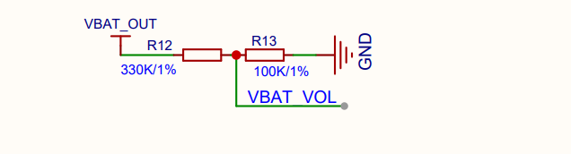
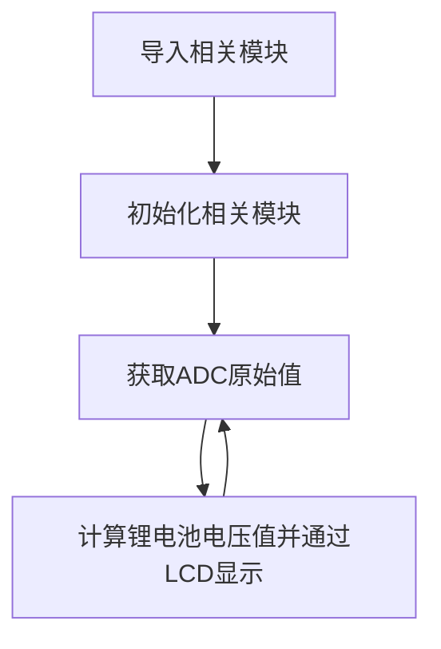
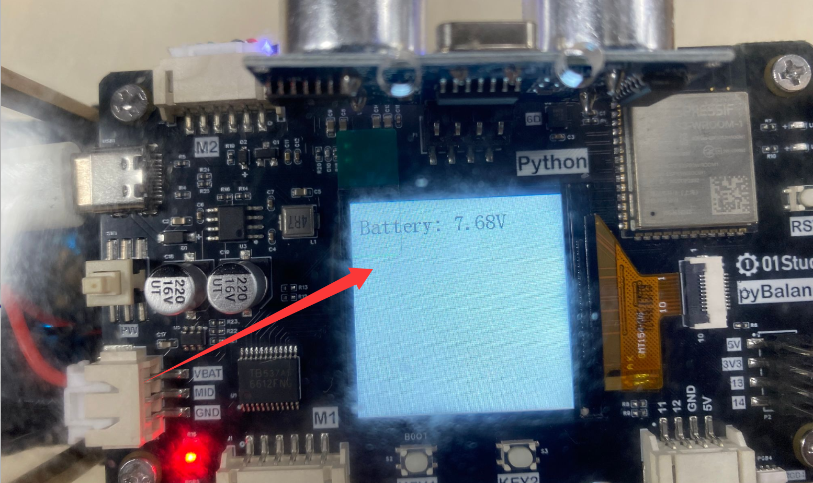
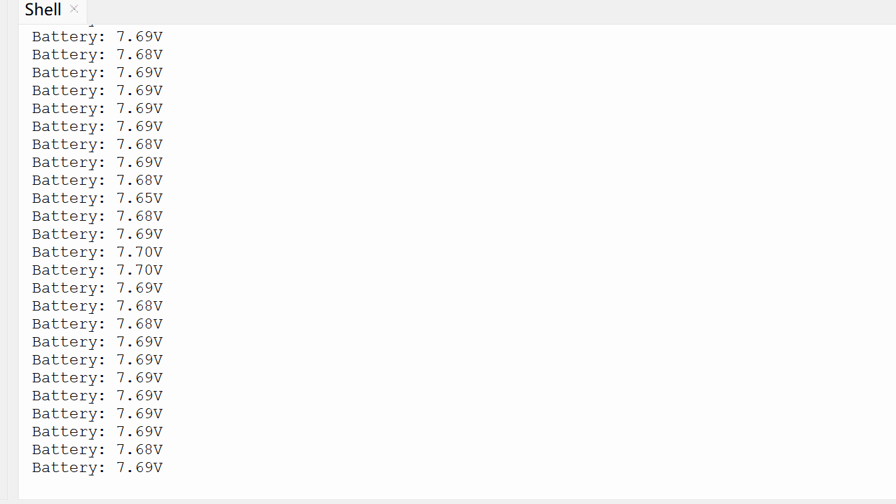

# 电池电量（ADC）

## 前言

ADC(analog to digital conversion) 模拟数字转换。意思就是将模拟信号转化成数字信号，由于单片机只能识别二级制数字，所以外界模拟信号常常会通过ADC转换成其可以识别的数字信息。常见的应用就是将变化的电压转成数字信号实现对电压值测量。

pyBalance上带有锂电池电压测量电路，通过电压测量我们可以判断电池电量。

## 实验目的

通过编程调用MicroPython的内置ADC函数，实现电池电量测量。

## 实验讲解

pyBalance装有二节3.7V的锂电池（充满电最高可达8.4V）。但ESP32-S3的IO耐压是3.3V，因此我们可以通过一个分压电路实现对高于3.3V电压值的测量。电路原理图如下：



从上图可以看到，锂电池电压经过 330 kΩ 和 100 kΩ 两个电阻分压后，连接到信号网络 VBAT VOL。VBAT VOL 是原理图中的信号网络名称，实际连接至 ESP32-S3 的 GPIO10 。因此可得到电池VBAT与实际测量电压ADC的对应关系：VBAT / (330K+100K) = ADC / 100K ; 即：VBAT = ADC * 4.3

ESP32-S3的ADC默认量程为0-1V（0-4095），由于本电路的 ADC 输入电压最高约为 1.95V，因此需要设置较高的 ADC 衰减档位，以保证输入电压处于 ADC 的有效测量范围内。我们来看看ADC模块的构造函数和使用方法。

## ADC对象

### 构造函数

```python
adc = machine.ADC(Pin(id))
```

构建ADC对象，ADC引脚对应如下：

- `pin` : 支持ADC的Pin对象，如：Pin(2) 。

### 使用方法

```python
adc.read()
```
返回的是 ADC 原始数字值。默认测量精度是12位，返回0-4095（对应电压0-1V）。

```python
ADC.read_uv()
```
获取经过校准后的 ADC 输入电压，单位为微伏（μV）。该方法利用 ADC 的已知特性以及芯片制造时写入 eFuse 的校准数据进行电压换算，因此相比直接使用 adc.read() 原始值进行比例换算更加准确。

```python
adc.atten(attenuation)
```
配置衰减器。配置衰减器能增加电压测量范围，以牺牲精度为代价的。
- `attenuation` ：衰减设置。
    - `ADC.ATTN_0DB` ：0dB衰减，最大测量电压1.00V。（默认配置）
    - `ADC.ATTN_2_5DB` ： 2.5dB 衰减, 最大输入电压约为 1.34v；
    - `ADC.ATTN_6DB` ：6dB 衰减, 最大输入电压约为 2.00v；
    - `ADC.ATTN_11DB` ：11dB 衰减, 最大输入电压约为3.3v

更多用法请阅读官方文档：<br></br>
https://docs.micropython.org/en/latest/esp32/quickref.html#adc-analog-to-digital-conversion

<br></br>

先导入相关模块，然后初始化模块。在循环中不断读取GPIO10的ADC值，然后计算锂电池电压，通过LCD显示，每隔1秒读取一次，具体如下：



## 参考代码
```python
'''
实验名称：电池电量（ADC）
版本：v1.0
日期：2026.8
作者：01Studio
说明：测量电池电压值
'''

#导入相关模块
from tftlcd import LCD15
from machine import Pin,ADC,Timer

#定义常用颜色
RED = (255,0,0)
GREEN = (0,255,0)
BLUE = (0,0,255)
BLACK = (0,0,0)
WHITE = (255,255,255)

########################
# 构建1.5寸LCD对象并初始化
########################
d = LCD15(portrait=2) #默认方向竖屏

#填充白色
d.fill(WHITE)

#电池电压测量引脚初始化
adc = ADC(Pin(10))

adc.atten(ADC.ATTN_11DB)

def ADC_Test(tim):
    # 读取分压后的电压，read_uv() 返回单位为 μV
    v_adc = adc.read_uv() / 1000000.0

    # 330kΩ 和 100kΩ 分压，恢复实际电池电压
    v = v_adc * 4.3

    #显示原始值
    d.printStr('Battery: '+str('%.2f'%v)+'V  ',10,15,color=BLACK,size=2)
    
    #串口REPL打印
    print('Battery: '+str('%.2f'%v)+'V  ')

#开启定时器
tim = Timer(1)
tim.init(period=1000, mode=Timer.PERIODIC, callback=ADC_Test) #周期1s
```

## 实验结果

运行代码，可以看到thonny终端定时打印电压信息，lcd实时显示电压。





这一节我们学习了电池电量测量，当观察到电压不足时候，就要去充电了。[充电教程>>](../intro/charge.md)