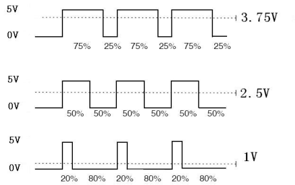
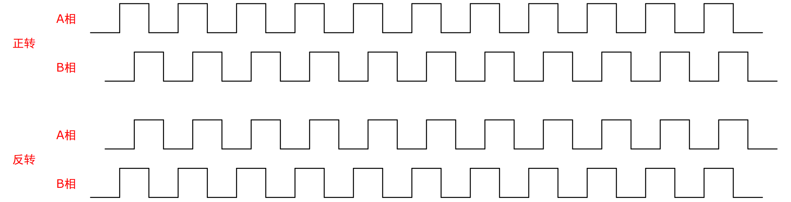
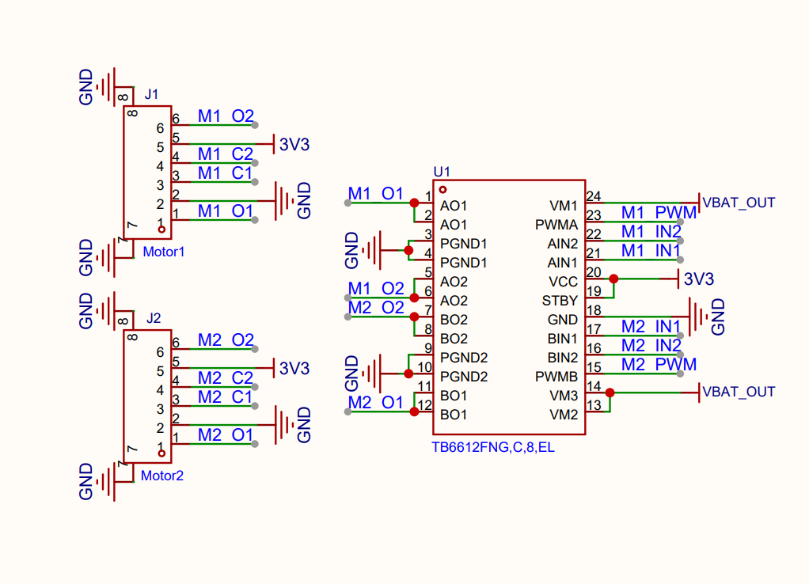
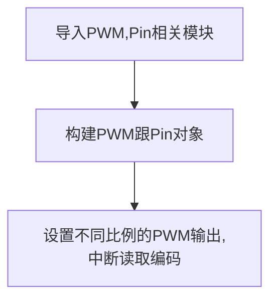
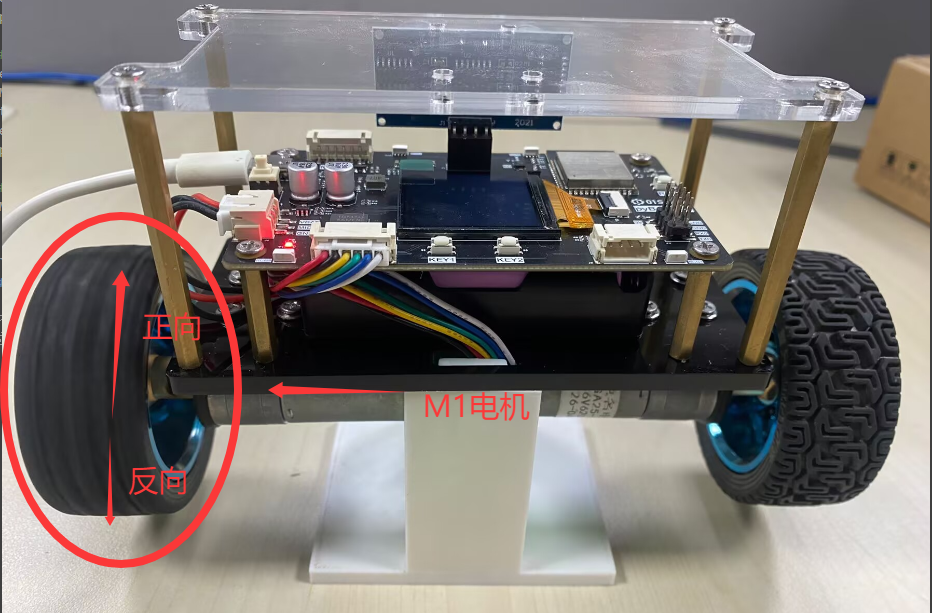
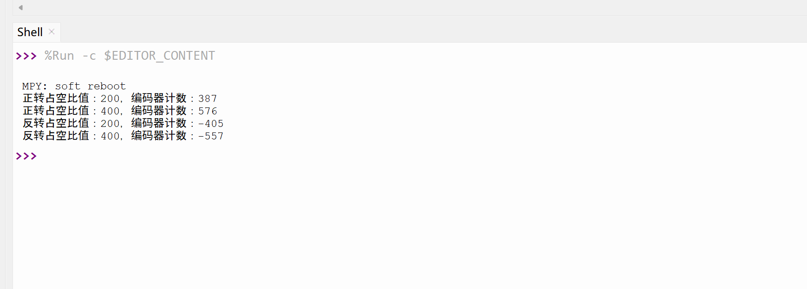

# 电机控制（PWM）

## 前言

PWM（脉冲宽度调制）就是一个特定信号输出，主要用于输出不同频率、占空比（一个周期内高电平出现时间占总时间比例）的方波。以实现固定频率或平均电压输出。

pyBalance 上配有 2 个带 AB 正交编码器的 JGA25-370 直流减速电机。今天我们将使用 MicroPython 的 PWM 功能控制电机转速，同时读取 AB 编码器信号，计算电机的实际转速并判断转动方向，通过实验观察 PWM 占空比与电机转速之间的关系。

## 实验目的

通过 PWM 信号控制 pyBalance 上的 JGA25-370 直流减速电机转速，并通过读取编码器脉冲，观察不同 PWM 占空比下编码器脉冲数量的变化。

## 实验讲解

电机控制主要用到PWM（脉冲宽度调制），GPIO输出不同频率、占空比（一个周期内高电平出现时间占总时间比例）的方波。以实现固定频率或平均电压输出。

如下图，可以看到当频率固定时，占空比越大（高电平占时间越长），等效电压越高，电机转速就越快。



AB 正交编码器包含 A、B 两路方波信号，两路信号的相位相差约 90°。电机正转和反转时，A、B 两路信号的领先关系会发生变化，例如正转时 A 相领先 B 相，反转时 B 相领先 A 相，因此可以通过两相信号的变化顺序判断电机的转动方向。同时，在一定时间内统计编码器产生的脉冲数量，就可以计算电机的转速。



本实验使用电机 M1 进行测试。从原理图可以看到，M1 的两个电机端子 M1_O1、M1_O2 分别连接到 TB6612FNG 的 AO1、AO2 输出端，由驱动芯片为电机提供驱动电流。ESP32-S3 通过 M1_IN1 和 M1_IN2 控制电机的转动方向，通过 M1_PWM 输出 PWM 信号调节电机转速；其中 M1_PWM 连接 GPIO4，M1_IN1 连接 GPIO5，M1_IN2 连接 GPIO6。电机自带编码器，其 M1_C1 和 M1_C2 为两路编码器信号，分别连接 GPIO7 和 GPIO15，可通过读取两路脉冲信号计算电机的转速和转动方向。



SP32-S3 支持在大多数具有输出功能的 GPIO 引脚上输出 PWM 信号，PWM 频率可以根据实际需求进行设置。在电机控制中，ESP32-S3 通过向电机驱动芯片输出 PWM 信号调节电机转速，同时通过方向控制引脚控制电机正反转。对于 AB 编码器信号，可以使用 ESP32-S3 的 PCNT 硬件脉冲计数器进行读取，也可以采用 GPIO 中断的方式进行计数。案例采用的是中断的方式进行计数，现在我们来看看PWM对象和使用方法。

## PWM对象

### 构造函数
```python
pwm = machine.PWM(machine.Pin(id), freq, duty)
```
构建PWM对象，PWM对象位于machine模块下。

- `machine.Pin(id)` ：引脚编号，如Pin(12);
- `freq` ：PWM频率，单位：Hz, 范围：1-40MHz;
- `duty` ：PWM占空比，范围：0-1023;

### 使用方法
```python
pwm.freq([value])
```
设置频率。不传参数返回当前频率。

<br></br>

```python
pwm.duty([value])
```
设置占空比。不传参数返回当前占空比。

<br></br>

```python
pwn.deinit()
```
注销PWM。

<br></br>

更多用法请阅读官方文档：<br></br>
https://docs.micropython.org/en/latest/library/machine.PWM.html#machine-pwm

<br></br>

由于本实验主要观察 PWM 占空比与电机转速之间的关系，并通过编码器脉冲计算实际转速，因此 PWM 频率保持固定，只调节占空比。直流电机控制通常会选择几 kHz 到十几 kHz 的 PWM 频率，本实验固定使用 10 kHz。

结合上述讲解，总结出代码编写流程图如下：



## 参考代码

```python
'''
实验名称：PWM
版本：v1.0
日期：2026.8
作者：01Studio
说明：在相同时间下观察不同 PWM 占空比下编码器脉冲数量的变化。
'''
from machine import Pin, PWM
import time

# 编码器脉冲数量计算
enc_count = 0
# 电机控制方向 1:正向，-1：反向
motor_dir = 1

# 编码器引脚
c1 = Pin(7, Pin.IN)
c2 = Pin(15, Pin.IN)

# 编码器单相上升沿中断计数
def encoder_irq(pin):
    global enc_count
    enc_count += 1


# C1上升沿触发中断
c1.irq(trigger=Pin.IRQ_RISING,handler=encoder_irq)

# 电机方向控制
m1_in1 = Pin(5, Pin.OUT, value=1)
m1_in2 = Pin(6, Pin.OUT, value=0)

# 初始化PWM，频率10000Hz，占空比0
M1 = PWM(Pin(4),freq=10000,duty=0)

# =========================
# 电机正转
# =========================

# 占空比200输出
enc_count = 0
M1.duty(200)
time.sleep(1)
enc_count = enc_count * motor_dir
print("正转占空比值：200，编码器计数：%d" % enc_count)

# 占空比400输出
enc_count = 0
M1.duty(400)
time.sleep(1)
enc_count = enc_count * motor_dir
print("正转占空比值：400，编码器计数：%d" % enc_count)

# 停止电机
M1.duty(0)
time.sleep_ms(200)

# =========================
# 电机反转
# =========================

m1_in1.value(0)
m1_in2.value(1)
motor_dir = -1

# 占空比200输出
enc_count = 0
M1.duty(200)
time.sleep(1)
enc_count = enc_count * motor_dir
print("反转占空比值：200，编码器计数：%d" % enc_count)

# 占空比400输出
enc_count = 0
M1.duty(400)
time.sleep(1)
enc_count = enc_count * motor_dir
print("反转占空比值：400，编码器计数：%d" % enc_count)

# 停止电机
M1.duty(0)


```
## 实验结果

在 Thonny IDE 中运行程序后，电机 M1 首先按照设定的 PWM 占空比正向旋转，随后切换方向进行反向旋转。随着 PWM 占空比增大，可以直观看到电机的转动速度随之提高。



程序运行过程中，Thonny 终端会输出不同 PWM 占空比下的编码器计数值。在相同的统计时间内，PWM 占空比越大，编码器计数值的绝对值就越大，说明电机转速越高；通过正转和反转时计数值的符号相反，可以区分电机的转动方向。



本实验采用编码器单相上升沿的软件中断方式进行计数，正转和反转时计数值的正负由程序根据电机控制方向设置。由于软件中断方式存在一定的响应延迟，编码器计数可能存在一定误差；同时，直流减速电机本身存在死区，且正反转时的实际运行状态也可能存在差异，因此在相同 PWM 占空比下，正反转的编码器计数不一定完全相同。本实验的计数结果主要用于观察不同 PWM 占空比下电机转速的变化趋势。若需要更加稳定、精确地读取 AB 正交编码器，可以进一步了解 ESP32-S3 的 PCNT 硬件脉冲计数器及其 MicroPython 使用方法，具体可参考[MicroPython ESP32 PCNT 官方文档](https://docs.micropython.org/en/latest/library/esp32.html#pcnt)。
