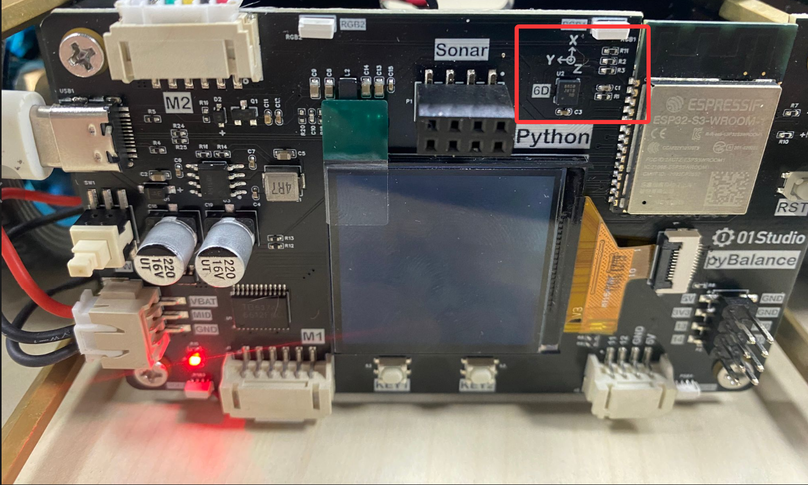
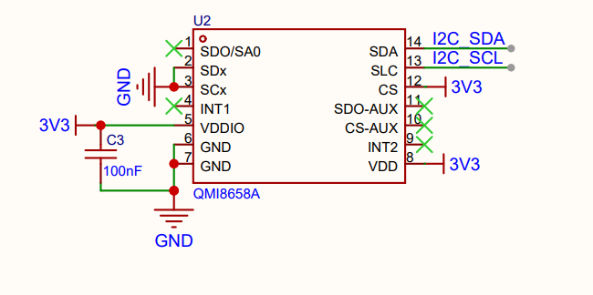
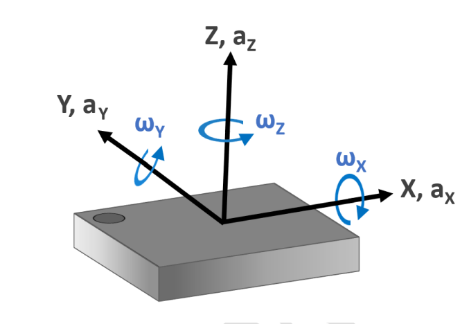
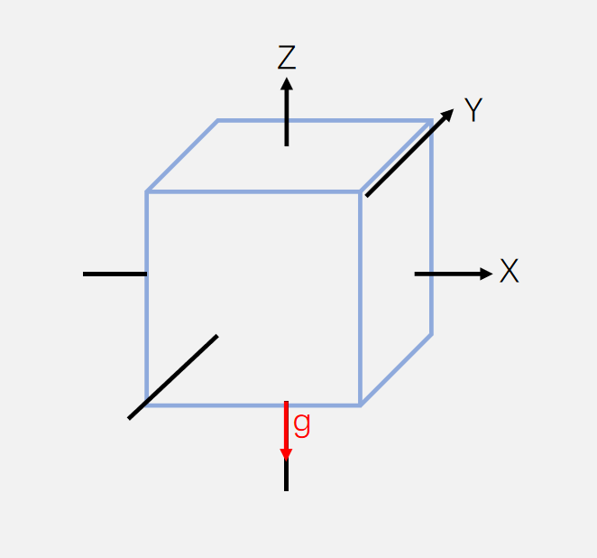
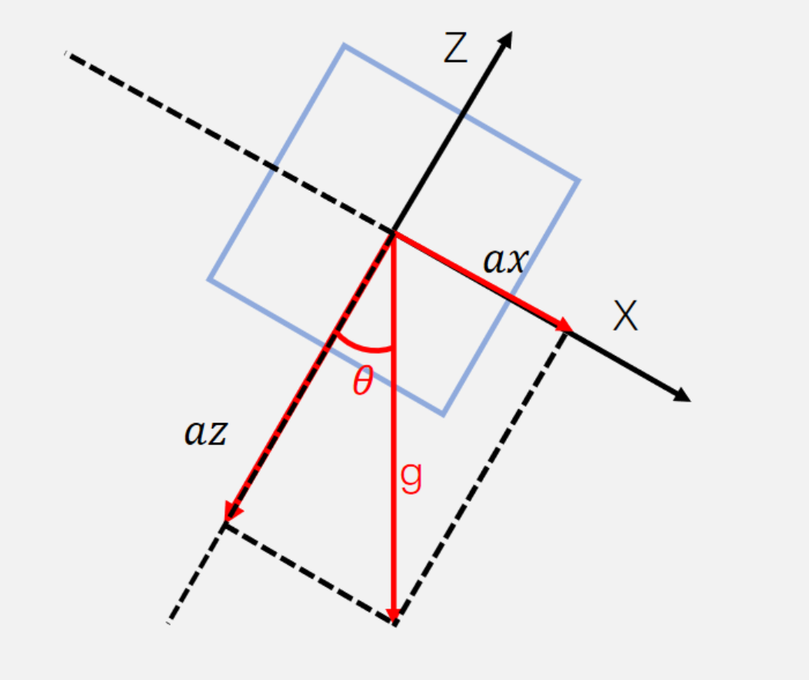
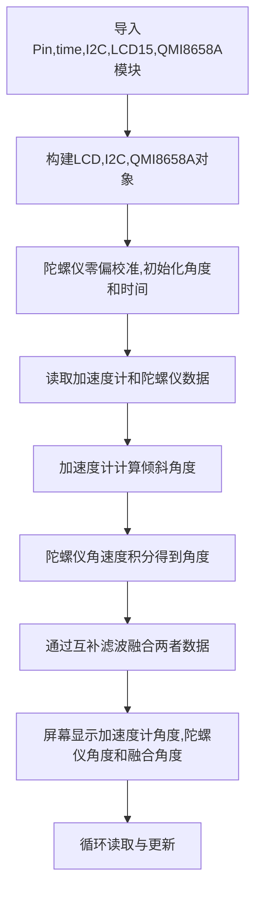
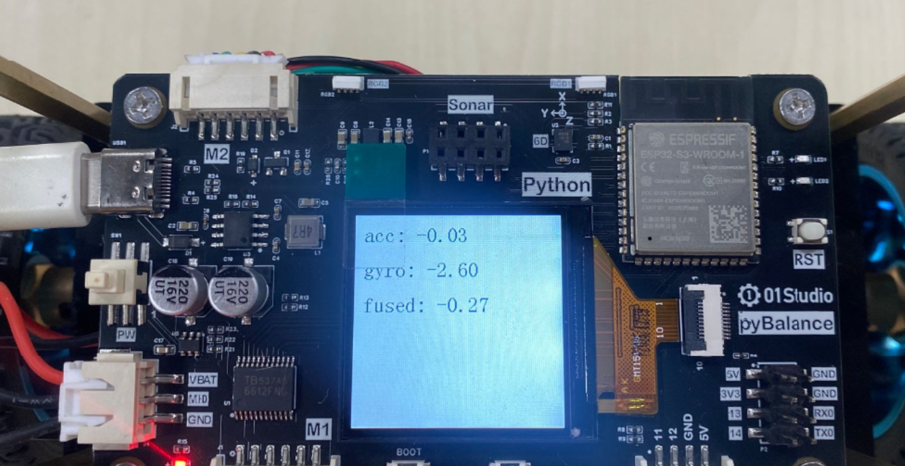
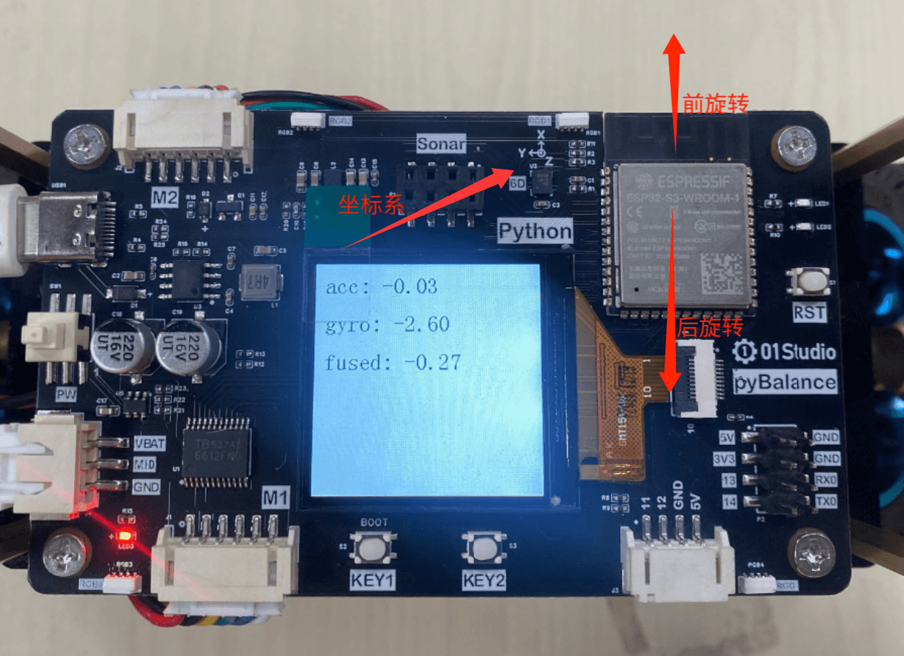
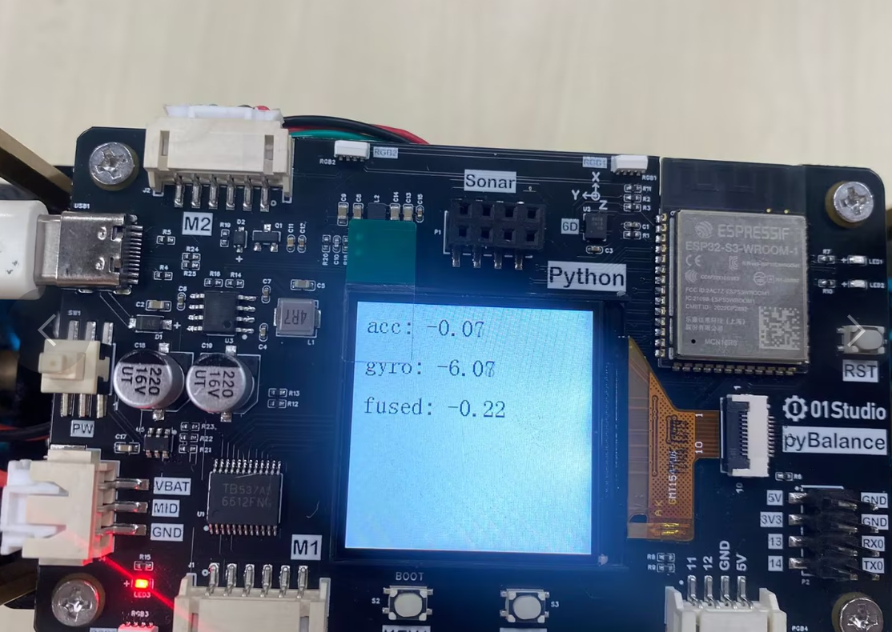
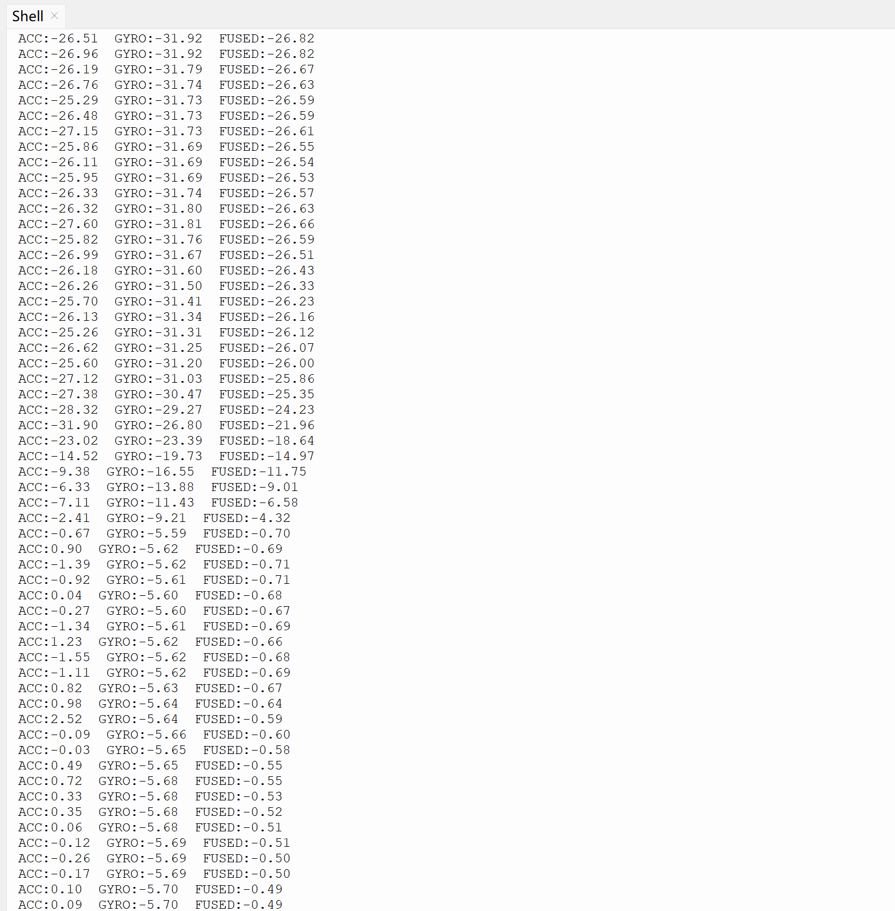

# QMI8658A六轴

## 前言
QMI8658A 是一款六轴惯性测量单元（IMU），内部集成三轴加速度计和三轴陀螺仪，可以分别测量 X、Y、Z 三个方向的加速度和角速度。利用这些数据，可以进一步计算设备的倾斜角度，并通过加速度计与陀螺仪的数据融合获得更加稳定的姿态信息。主要用于飞行器、平衡车、机器人等需要感知自身姿态和运动状态的应用场景。本节将通过编程学习 QMI8658A 的基本使用方法，了解传感器内部数据寄存器的读取过程，并学习如何将寄存器中的原始数据转换为实际的加速度和角速度等物理量。

## 实验平台

pyBlance开发板。载板上的QMI8658A传感器

## 实验目的

通过编程读取 QMI8658A 的传感器数据，了解原始数据的解析与换算过程；分别利用加速度计计算倾斜角度、利用陀螺仪角速度积分得到角度，再将两者进行融合得到更加稳定的姿态角。通过比较加速度计角度、陀螺仪角度和融合角度的变化，了解不同姿态估计方式的特点，最后将实验数据实时显示在 LCD 屏幕上。

## 实验讲解

QMI8658A 传感器位于 pyBalance 开发板正面的屏幕右上方：



QMI8658A 测量得到的加速度和角速度数据首先保存在芯片内部的数据寄存器中。主控 通过 I2C 读取这些寄存器中的数据，并将每个轴对应的高、低字节组合成 16 bit 有符号原始数据。由于原始数据只是传感器内部的数字量，还需要根据当前设置的量程和灵敏度进行换算，才能得到具有实际物理意义的加速度和角速度。注意了I2C_SDA,I2C_SCL是原理图中的信号网络名称，I2C_SDA实际连接至 ESP32-S3 的 GPIO1。I2C_SCL 实际连接至 ESP32-S3 的 GPIO2。



|  功能参数 |
|  :---:  | ---  |
| 芯片型号  | QMI8658A |
| 供电电压  | 3.3V |
| 控制方式  | I2C总线 (默认地址：0x6A) |
| 测量维度  | 加速度：3维 / 陀螺仪：3维 | 
| 加速度测量范围  | ±2/±4/±8/±16g |
| 陀螺仪测量范围  | ±16/±32/±64/±128/±256/±512/±1024/±2048°/s|
| ADC位数  | 16位 |
| 温度传感器  | 测量范围：-40℃~85℃（精度：±1℃） |

上面介绍可以看到，QMI8658A是一款通过I2C接口驱动的传感器。通过I2C接口使用即可以对该模块实现数据通讯。

## 原理

QMI8658A 内部集成了三轴加速度计和三轴陀螺仪，可以输出 X、Y、Z 三个方向的加速度，以及绕 X、Y、Z 三个轴旋转的角速度。

QMI8658A 的坐标系定义如下图所示：



加速度计分别测量 X、Y、Z 三个方向上的加速度，陀螺仪分别测量绕 X、Y、Z 三个轴旋转的角速度。

### 原始数据与实际单位

通过 I2C 读取 QMI8658A 时，加速度计和陀螺仪输出的首先是 16 bit 有符号原始数据，其取值范围为：

```text
-32768 ~ 32767
```

原始数据本身只是传感器输出的数字量，需要根据当前设置的测量量程，才能换算成实际的加速度或角速度。

以加速度计设置为 `±8 g` 量程为例。

`±8 g` 表示可以测量 `-8 g ~ +8 g`，整个测量范围为 `16 g`。16 bit 数据共有 65536 个可能的编码，因此：

```text
65536 / 16 = 4096 LSB/g
```

也就是说，`1 g` 的加速度大约对应 4096 个原始计数，因此：

```text
加速度(g) = raw / 4096
```

例如：

```text
raw = 4096  →  1 g
raw = 2048  →  0.5 g
```

如果需要转换为国际单位 `m/s²`，可以继续计算：

```text
加速度(m/s²) = 加速度(g) × 9.80665
```

不同的加速度量程对应不同的灵敏度：

| 加速度量程 | 灵敏度 |
| --- | --- |
| ±2 g | 16384 LSB/g |
| ±4 g | 8192 LSB/g |
| ±8 g | 4096 LSB/g |
| ±16 g | 2048 LSB/g |

测量量程越小，单位加速度对应的原始计数越多，能够分辨更加细微的变化；量程越大，则可以测量更大的加速度。

陀螺仪的数据换算方式与加速度计相同。

例如，将陀螺仪量程设置为 `±1024 °/s`，表示可以测量 `-1024 °/s ~ +1024 °/s`，整个测量范围为 `2048 °/s`，因此：

```text
65536 / 2048 = 32 LSB/(°/s)
```

也就是说，`1 °/s` 的角速度大约对应 32 个原始计数，因此：

```text
角速度(°/s) = raw / 32
```

例如：

```text
raw = 320  →  10 °/s
```

需要注意，加速度计和陀螺仪的量程是分别独立配置的，两者互不影响。

### 加速度计获取角度

加速度计可以利用重力在各坐标轴上的分量计算传感器的倾斜角。

当传感器静止，且 Z 轴竖直向上时，重力方向始终竖直向下。此时加速度计在 Z 轴方向上的读数最大，而 X、Y 轴方向上的读数接近 0。



传感器静止不动，并绕 Y 轴发生倾斜时，重力加速度在传感器的 X 轴和 Z 轴方向上分别产生分量，记为 `ax` 和 `az`。由于这里仅绕 Y 轴转动，因此可以忽略 Y 轴分量。



根据三角关系可得：

```text
tan(θ) = ax / az
```

因此可以进一步计算倾斜角：

```text
θ = atan2(ax, az)
```

其中：

- `ax`：X 轴方向的加速度分量
- `az`：Z 轴方向的加速度分量
- `θ`：传感器绕 Y 轴的倾斜角

 注意：上图以绕 Y 轴倾斜为例，使用 `ax` 和 `az` 计算倾斜角；绕 X 轴倾斜时原理相同，使用 `ay` 和 `az` 进行计算。绕 Z 轴属于水平旋转，无法仅通过加速度计计算旋转角度。计算出角度的正负方向与传感器的安装方向和坐标系定义有关。例如绕 Y 轴时，可以分别向 X 轴正、反方向倾斜传感器，观察 `ax` 和计算角度的正负变化，从而确认角度方向。

### 陀螺仪获取角度

陀螺仪与加速度计不同，它不能直接得到传感器当前倾斜了多少度，而是测量传感器绕各坐标轴旋转的角速度，单位为 `°/s`。

例如，Y 轴陀螺仪输出：

```text
gy = 20 °/s
```

表示传感器当前正以每秒 `20°` 的速度绕 Y 轴旋转。

如果在很短的一段时间 `dt` 内，可以认为角速度基本不变，那么这一小段时间内旋转的角度为：

```text
Δθ = ω × dt
```

例如：

```text
ω  = 20 °/s
dt = 0.1 s
```

则：

```text
Δθ = 20 × 0.1 = 2°
```

不断计算每一小段时间产生的角度变化并进行累加，就可以得到相对于初始位置的旋转角度：

```text
θ = θ + ω × dt
```

在实际的应用中陀螺仪即使完全静止，输出的角速度通常也不会刚好为 `0`，而是会存在一个很小的偏差，这个偏差称为零偏。

例如传感器静止时仍然测得：

```text
gy = 0.5 °/s
```

如果直接进行积分，即使传感器完全没有移动，计算出来的角度也会不断增加：

```text
1 秒   → 0.5°
10 秒  → 5°
60 秒  → 30°
```

因此，在使用陀螺仪计算角度之前，通常需要先进行零偏校准。

校准时保持传感器静止，连续读取多次角速度并计算平均值：

```text
gyro_offset = 静止时多次角速度的平均值
```

之后每次读取陀螺仪时，先减去这个零偏：

```text
ω = gyro - gyro_offset
```

再使用修正后的角速度进行积分：

```text
θ = θ + ω × dt
```

因此，陀螺仪计算角度的基本过程可以概括为：

```text
读取角速度
    ↓
减去零偏
    ↓
得到修正后的角速度
    ↓
乘以时间 dt
    ↓
得到角度变化 Δθ
    ↓
不断累加得到角度 θ
```

需要注意的是，零偏校准只能减小误差，并不能完全消除误差。陀螺仪的微小测量误差经过长时间积分后仍会不断累积，使计算出的角度逐渐偏离真实角度，这种现象称为积分漂移。

> **说明：** 上述示例是在陀螺仪原始数据转换为角速度后进行零偏校准。实际应用中，也可以直接对陀螺仪原始数据进行多次采样取平均，得到原始零偏值，并在后续读取时先减去该零偏，再换算为角速度。两种方式的原理相同。

### 加速度计与陀螺仪数据融合

通过前面的介绍可以发现，加速度计和陀螺仪都可以用于计算姿态角，但它们各自存在不同的问题。

加速度计可以根据重力方向直接计算倾斜角，因此长时间使用不会产生角度累计漂移。但是当传感器快速运动、振动或受到冲击时，额外的运动加速度会影响计算结果，使角度出现较大的波动。

陀螺仪对旋转变化非常灵敏，短时间内通过积分得到的角度比较平滑，但是陀螺仪存在零偏和测量误差，这些误差经过不断积分后会逐渐累积，使角度慢慢发生漂移。

因此，可以将加速度计和陀螺仪的角度信息结合起来：

```text
加速度计 → 长时间方向参考
陀螺仪   → 短时间角度变化
```

这样既可以利用陀螺仪快速、平滑的动态响应，又可以利用加速度计对角度进行长期修正。在实际应用中，通常会将加速度计和陀螺仪的数据进行融合，以获得更加稳定、可靠的姿态角。

常用并且比较简单的方法是 互补滤波（Complementary Filter）。

互补滤波首先利用陀螺仪计算下一时刻的角度：

```text
gyro_angle = angle + gyro × dt
```

然后再与加速度计计算得到的角度进行加权：

```text
angle = α × gyro_angle + (1 - α) × acc_angle
```

也可以写成：

```text
angle = α × (angle + gyro × dt)
      + (1 - α) × acc_angle
```

其中：

- `angle`：融合后的姿态角
- `gyro`：经过零偏校准后的陀螺仪角速度
- `dt`：两次计算之间的时间
- `acc_angle`：通过加速度计计算得到的倾斜角
- `α`：融合系数，范围为 `0 ~ 1`

例如：

```text
α = 0.98
```

表示当前角度主要跟随陀螺仪的快速变化，同时使用少量加速度计数据不断修正陀螺仪产生的漂移：

```text
angle = 0.98 × (angle + gyro × dt)
      + 0.02 × acc_angle
```

## I2C对象
I2C 可以分为软件模拟 I2C 和硬件 I2C。实验使用的是硬件 I2C。

### 构造函数
```python
i2c = I2C(id, *, scl, sda, freq=400000, timeout=50000)
```
构建i2c对象。注意了pyBalance板子(ESP32-S3) I2C 支持将 SCL 和 SDA 配置到可用 GPIO，并不是固定只能使用某两个引脚。

参数说明：
- `id` : I2C 控制器编号，在 pyBalance板子(ESP32-S3) 上可使用 0 或 1。
- `scl` : I2C 时钟线 SCL 使用的 Pin 对象。
- `sda` : I2C 数据线 SDA 使用的 Pin 对象。
- `freq` : I2C 通信频率，单位 Hz，默认值为 400000，即 400 kHz。
- `timeout` : I2C 通信超时时间，单位 µs，默认值为 50000；部分平台可能不支持该参数

### 使用方法

```python
data = i2c.readfrom_mem(addr, memaddr, nbytes, *, addrsize=8)
```

返回值是从指定寄存器地址开始读取到的数据。在 QMI8658A 中，主要用于读取三轴加速度和三轴陀螺仪的原始数据。

参数说明：
- `addr` : I2C 从设备地址。
- `memaddr` : 需要读取的内部寄存器地址。
- `nbytes` : 需要读取的字节数。
- `addrsize` : 寄存器地址位宽，默认 8 bit。

```python
i2c.writeto_mem(addr, memaddr, buf, *, addrsize=8)
```

没有返回值，该方法通常用于配置传感器内部寄存器，例如设置 QMI8658A 加速度计和陀螺仪的测量量程、输出数据速率以及滤波参数等。

参数说明：

- `addr` : I2C 从设备地址。
- `memaddr` : 需要读取的内部寄存器地址。
- `buf` : 需要写入的数据，通常为 bytes 或其他缓冲区对象。
- `addrsize` : 寄存器地址位宽，默认 8 bit。

更多用法请阅读官方文档：<br></br>
https://docs.01studio.cc/library/machine.I2C.html?highlight=i2c

上面介绍的 I2C 基本使用方法只需要简单了解即可。在实际使用 QMI8658A 时，通常不需要我们直接进行寄存器读写以及原始数据的解析和换算，这些底层操作已经封装在例程文件夹中的 qmi8658a.py 驱动文件中。如果需要调整加速度计或陀螺仪的测量量程等参数，可以通过对应的函数进行修改。接下来我们主要学习 QMI8658A 的构造方法以及常用的数据读取方法。

## qmi8658a对象

### 构造函数
```python
qmi8658a = QMI8658A(i2c, address=0x6A)
```

构建QMI8658A对象。

参数说明：

- `i2c` : I2C 通信对象。
- `address` : QMI8658A 的 I2C 地址，默认使用 0x6A。

### 使用方法

```python
ax, ay, az = qmi8658a.acceleration
```

获取 X、Y、Z 三个轴方向的加速度，单位为 m/s²。

```python
gx, gy, gz = qmi8658a.gyro
```

获取绕 X、Y、Z 三个轴旋转的角速度，单位为 rad/s。注意了陀螺仪原始数据的换算过程，qmi8658a.gyro已经是完成灵敏度换算，并进一步将角速度转换为 rad/s ，真实数据计算中不要搞错单位了。

```python
range_value = qmi8658a.accelerometer_range
```

读取当前加速度计测量量程，X、Y、Z 三个轴共用同一个量程配置。

```python
qmi8658a.accelerometer_range = AccRange.RANGE_8_G
```

设置加速度计的测量量程为 ±8 g，该设置同时作用于 X、Y、Z 三个轴。

```python
rate_value = qmi8658a.accelerometer_rate
```

读取当前加速度计数据输出速率，即加速度计每秒更新数据的频率。

```python
qmi8658a.accelerometer_rate = AccRate.RATE_2000_HZ
```
设置加速度计数据输出速率为2000hz。即每秒输出 2000 次加速度数据。

```python
range_value = qmi8658a.gyro_range
```

读取当前陀螺仪测量量程，X、Y、Z 三个轴共用同一个量程配置。

```python
qmi8658a.gyro_range = GyroRange.RANGE_512_DPS
```

设置陀螺仪的测量量程为 ±512 °/s，该设置同时作用于 X、Y、Z 三个轴。

```
rate_value = qmi8658a.gyro_rate
```

读取当前陀螺仪数据输出速率，即陀螺仪每秒更新数据的频率。

```
qmi8658a.gyro_rate = GyroRate.RATE_G_2000_HZ
```

设置陀螺仪数据输出速率为 2000 Hz，即每秒输出 2000 次角速度数据。

<br></br>

更多 API 用法请参考以下文档：<br></br>
https://circuitpython-qmi8658c.readthedocs.io/en/latest/api.html#qmi8658c.GyroRate

本驱动已针对 QMI8658A 和 MicroPython 进行适配。API 接口及使用方式与原 CircuitPython 驱动保持一致，主要区别在于底层硬件平台和 I2C 通信接口不同：原驱动使用 CircuitPython 的硬件访问方式，本驱动则使用 MicroPython 的 machine.I2C。

根据 QMI8658A 的坐标系，本实验主要测量绕 Y 轴旋转的姿态角。首先利用加速度计计算倾斜角度，再利用陀螺仪角速度积分得到角度，最后通过互补滤波融合两者数据。将加速度计角度、陀螺仪角度和融合角度同时显示在 LCD 屏幕上，以便观察和比较三种角度的变化。



## 参考代码

```python
'''
实验名称：QMI8658A六轴
版本：v1.0
日期：2026.8
作者：01Studio
说明：获取加速度计角度,陀螺仪角度以及加速计跟陀螺仪的融合角度
'''
import time
from machine import Pin,I2C
from tftlcd import LCD15
from qmi8658a import QMI8658A
import math

#定义常用颜色
RED = (255,0,0)
GREEN = (0,255,0)
BLUE = (0,0,255)
BLACK = (0,0,0)
WHITE = (255,255,255)

########################
# 构建1.5寸LCD对象并初始化
########################
d = LCD15(portrait=2) #默认方向竖屏

# 填充白色
d.fill(WHITE)

# 构建i2c对象
i2c = I2C(0, scl=Pin(2), sda=Pin(1), freq=400000, timeout=50000)

# 构建qmi8658a
qmi8658a = QMI8658A(i2c)

# 弧度转角度的转换系数
RAD_TO_DEG = 180.0 / math.pi

# 互补滤波系数
ALPHA = 0.98

# ==============================
# 陀螺仪 Y 轴零偏校准
# ==============================

def gyro_calibrate(samples=500):
    gy_sum = 0.0

    print("Gyro calibrating, keep sensor still...")

    for i in range(samples):
        gx, gy, gz = qmi8658a.gyro

        gy_sum += gy

        time.sleep_ms(2)

    gy_offset = gy_sum / samples

    print("Gyro calibration finished")
    print("gy offset:", gy_offset)

    return gy_offset

gy_offset = gyro_calibrate()

# ==============================
# 初始化角度
# ==============================

ax, ay, az = qmi8658a.acceleration

# 绕 Y 轴倾斜时，使用 X、Z 轴加速度计算角度
acc_angle = -math.atan2(ax, az) * RAD_TO_DEG

# 以当前姿态作为初始角度
gyro_angle = acc_angle
fused_angle = acc_angle

# 初始化时间
last_time = time.ticks_us()


while True:

    # 计算采样时间 dt
    now = time.ticks_us()
    dt = time.ticks_diff(now, last_time) / 1000000.0
    last_time = now
    
    # 读取传感器 16 位原始数据
    raw_ax, raw_ay, raw_az, raw_gx, raw_gy, raw_gz = qmi8658a.raw_acc_gyro

    # 读取经过qmi8658a库换算后的物理量加速计，陀螺仪数据
    ax, ay, az = qmi8658a.acceleration   # 单位：m/s²
    gx, gy, gz = qmi8658a.gyro           # 单位：rad/s

    # 加速度计计算倾角
    acc_angle = -math.atan2(ax, az) * RAD_TO_DEG

    # 陀螺仪 Y 轴零偏修正
    gy = gy - gy_offset
    
    # rad/s 转换单位 °/s
    gyro_rate = gy * RAD_TO_DEG

    # 陀螺仪积分得到角度
    gyro_angle += gyro_rate * dt

    # 互补滤波
    fused_angle = (ALPHA * (fused_angle + gyro_rate * dt) + (1.0 - ALPHA) * acc_angle)
    
    print("ACC:{:.2f}  GYRO:{:.2f}  FUSED:{:.2f}".format(acc_angle,gyro_angle,fused_angle))
    
    d.printStr('acc: '+str('%.2f'%acc_angle)+' ',10,10,color=BLACK,size=2)
    d.printStr('gyro: '+str('%.2f'%gyro_angle)+' ',10, 50,color=BLACK,size=2)
    d.printStr('fused: '+str('%.2f'%fused_angle)+'  ',10, 90,color=BLACK,size=2)
    
    
    time.sleep_ms(30)
```
## 实验结果

将资料包中的 qmi8658a.py 文件上传到开发板文件系统。保持开发板静止并运行程序，可以看到 LCD 屏幕上显示的加速度计角度、陀螺仪积分角度和融合角度基本接近。



随后将开发板绕 Y 轴前后转动数次，再恢复到初始静止姿态。



可以观察到，加速度计计算的 ACC 角度能够恢复到与初始静止时接近的数值，融合角度也会逐渐恢复并保持在 ACC 角度附近；而仅通过陀螺仪角速度积分得到的 GYRO 角度与初始值相比会产生较明显的偏差。





本案例以绕 Y 轴旋转为例计算姿态角。绕 X 轴旋转时，角度计算和互补滤波的方法相同，只需根据传感器的坐标轴方向选择对应的加速度计和陀螺仪数据，并注意角度正负方向。例程里面没有单独配置加速度计和陀螺仪的测量量程及数据输出速率，而是直接使用 QMI8658A 库里面的默认配置。其中，加速度计默认测量量程为 ±8 g，数据输出速率为 125 Hz；陀螺仪默认测量量程为 ±256 °/s，数据输出速率为 125 Hz。


