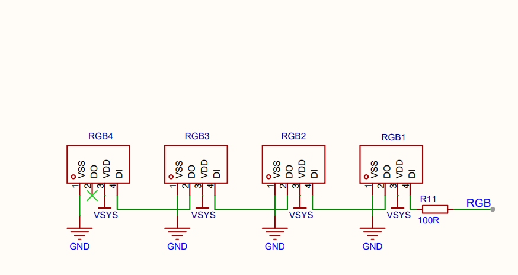
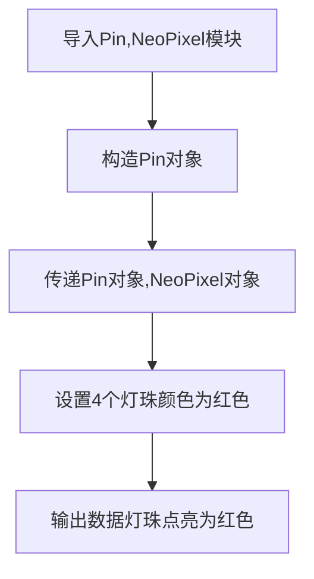
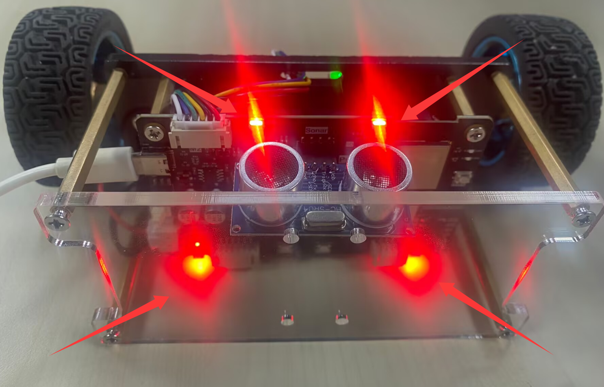
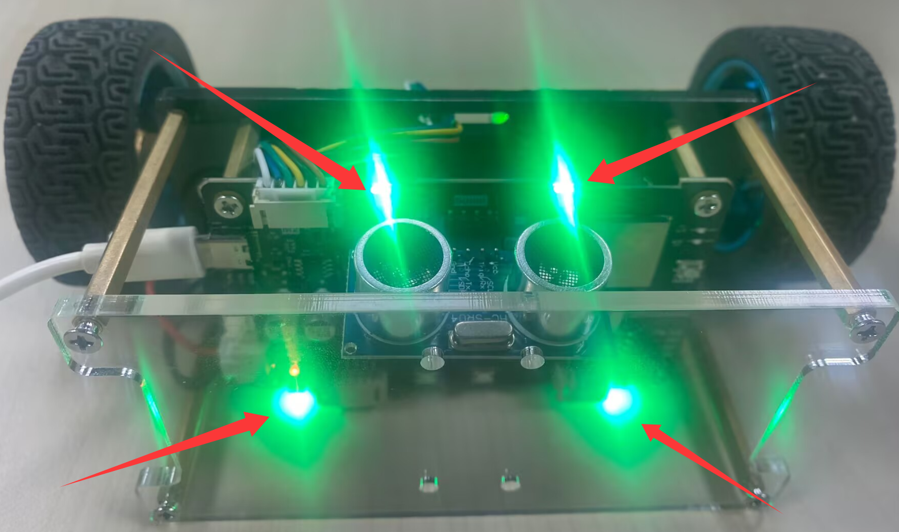
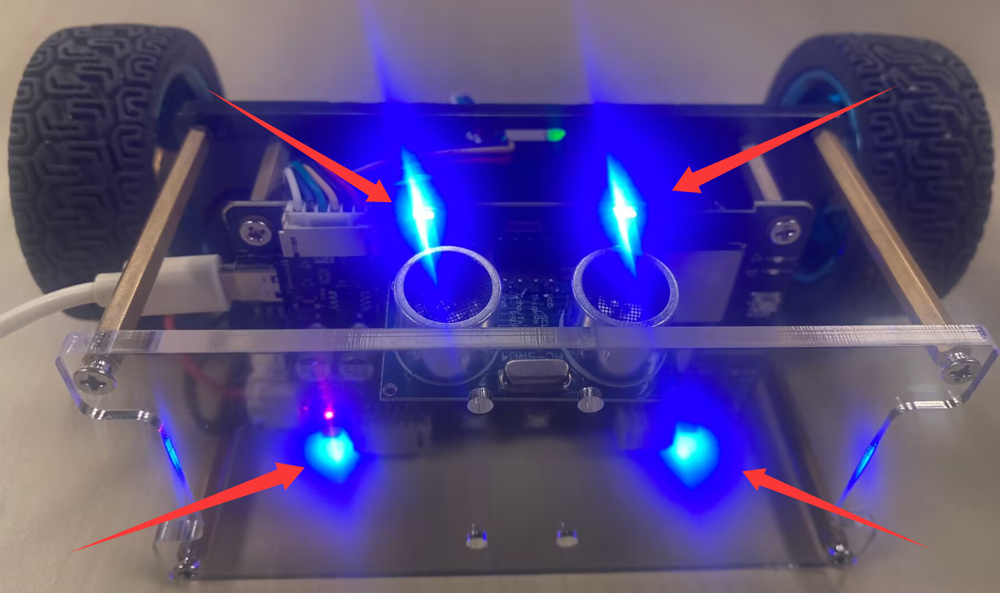
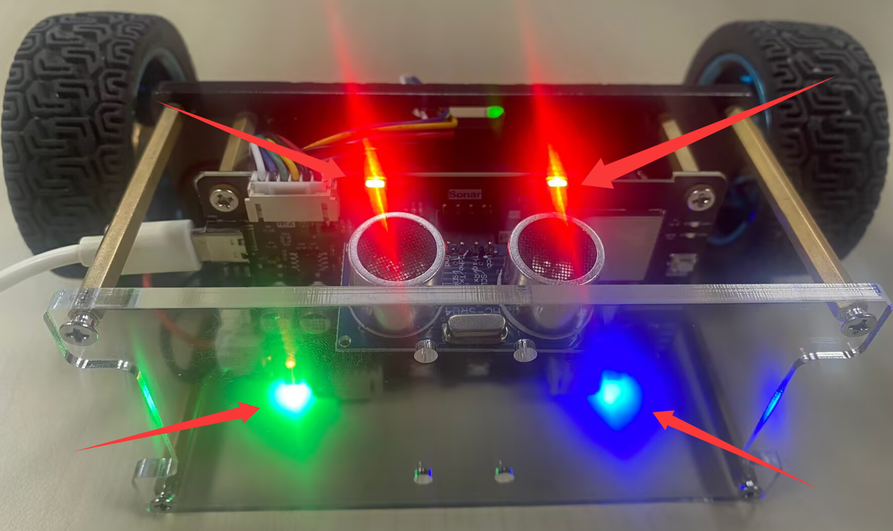

# RGB彩灯

## 前言

我们平常看到的彩色灯带，通常由多个 RGB 灯珠依次排列组成。本章节将通过编程实现多个 RGB 灯珠的独立控制和组合显示，从而实现丰富的灯光效果。

## 实验目的

通过编程实现多个 RGB 灯珠循环显示红色（RED）、绿色（GREEN）、蓝色（BLUE）和混合（红、绿、蓝）。

## 实验讲解

pyBalance 板载灯珠采用 WS2812B 可编程 RGB 灯珠，每颗灯珠内部集成了 RGB 发光单元和控制电路。多颗灯珠之间是通过 DIN 和 DOUT 首尾级联，所以只需一根数据线即可控制整条灯珠链。实现原理利用ESP32-S3芯片内部 RMT（Remote Control）外设生成 WS2812B 所需的精确高、低电平脉冲时序，并通过数据线连续发送所有灯珠的颜色数据。每颗灯珠使用 24 bit 表示颜色信息，其中 R、G、B 三个颜色通道各占 8 bit。数据在灯珠之间逐级传递，每颗灯珠接收属于自己的颜色数据，后续数据继续传递给下一颗灯珠，从而实现 4 颗 RGB 灯珠颜色的独立控制。（注意：原理图中的 RGB 是灯珠数据控制信号的网络名称，实际连接至 ESP32-S3 的 GPIO45。）



控制灯珠使用machine模块中的Pin对象，使用说明如下：

## Pin对象

Pin 对象用于配置和控制 ESP32-S3 的 GPIO 引脚。

### 构造函数

```python
from machine import Pin

pin = Pin(id, mode, pull)
```

Pin位于machine模块下，直接import使用:

- `id` ：芯片引脚编号。如：42、46。
- `mode` ：输入/输出模式。
    - `Pin.IN` : 输入模式；
    - `Pin.OUT` : 输出模式；   
- `pull`: 上下拉电阻配置。
    - `None` : 无上下拉电阻；
    - `Pin.PULL_UP` : 上拉电阻启用；
    - `Pin.PULL_DOWN` : 下拉电阻启用。

## NeoPixel对象

NeoPixel 对象用于控制串行 RGB 灯珠。

```python
from neopixel import NeoPixel 
np = NeoPixel(pin, n, *, bpp=3, timing=1)
```

NeoPixel位于neopixel模块，直接import使用:

- `pin` : 灯珠数据控制引脚，需要传入一个machine的 Pin 对象。
- `n` : 灯珠数量。
- `bpp` : 每颗灯珠包含的颜色通道数量:
    - `3` : RGB 灯珠，每颗灯珠使用 R、G、B 三个颜色通道;
    - `4` : RGBW 灯珠，每颗灯珠使用 R、G、B、W 四个颜色通道.
- `timing` : 灯珠通信时序配置，默认值为 1。一般情况下使用默认值即可。

### 使用方法

```python
np.fill(pixel)
```
设置所有灯珠为指定颜色。
- `pixel` : 颜色值，例：(255,0,0)表示红色。

```python
np[i] = pixel
```

设置某个灯珠的颜色。
- `pixel` : 颜色值，例：np[0] =(255,0,0) 表示第一个灯珠设置成红色。

```python
np.write()
```

将数据写入灯珠。前面配置完颜色后务必执行这个语句灯珠才会显示相应颜色。

<br></br>

更多用法请阅读官方文档：<br></br>
https://docs.micropython.org/en/latest/library/neopixel.html#module-neopixel

代码编写流程如下：



## 参考代码

```python
'''
实验名称：RGB彩灯
版本：v1.0
日期：2026.8
作者：01Studio
说明：通过编程实现RGB彩灯不同颜色的变化
'''
import time
from machine import Pin,Timer
from neopixel import NeoPixel

# 构建按键对象，GPIO0 配置为上拉输入
KEY = Pin(0, Pin.IN, Pin.PULL_UP)

# 灯珠状态，False 表示关闭，True 表示点亮
state = False

# 定义红、绿、蓝三种颜色
RED   = (255, 0, 0)
GREEN = (0, 255, 0)
BLUE  = (0, 0, 255)

# 黑色，表示灯珠关闭
BLACK = (0, 0, 0)

# 配置 GPIO45 为 RGB 灯珠数据输出引脚
pin = Pin(45, Pin.OUT)

# 板载 RGB 灯珠数量
NUM_LEDS = 4

# 构建 NeoPixel 对象
np = NeoPixel(pin, NUM_LEDS)

#设置灯珠RGB颜色。
def rgb():
    
    global RED,GREEN,BLUE
    
    for i in range(4):
        if i < 2:
            np[i]=RED
        elif i < 3:
            np[i]=GREEN
        else:
            np[i]=BLUE

while True:

    np.fill(RED) #红色
    np.write()     # 写入数据
    time.sleep(1)

    np.fill(GREEN) #绿色
    np.write()     # 写入数据
    time.sleep(1)

    np.fill(BLUE) #蓝色
    np.write()     # 写入数据
    time.sleep(1)
    
    #RGB彩色模式
    rgb()
    np.write()
    time.sleep(1)
```

## 实验结果

运行代码后，可以看到 4 颗 RGB 灯珠依次循环显示红色、绿色、蓝色以及彩色组合效果。在彩色组合状态下，前两颗灯珠显示红色，第 3 颗灯珠显示绿色，第 4 颗灯珠显示蓝色。









这一节的学习不仅是为了完成 RGB 灯珠实验。掌握灯珠颜色控制方法后，在后续应用中可以根据实际需求调整灯珠颜色，从而实现更加丰富、美观的显示效果。