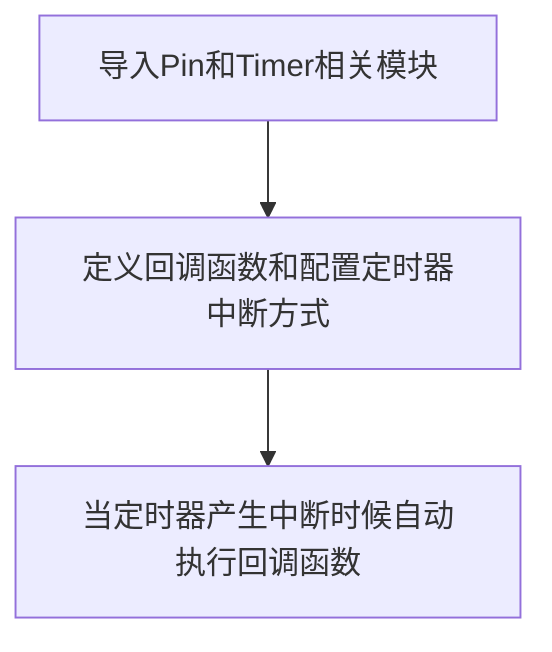

# 定时器

## 前言
定时器，顾名思义就是用来计时的，我们常常会设定计时或闹钟，然后时间到了就告诉我们要做什么了。单片机也是这样，通过定时器可以完成各种预设好的任务。

## 实验目的
通过定时器让LED蓝灯周期性每秒闪烁1次。

## 实验讲解

定时器是在machine的Timer模块。通过MicroPython可以轻松编程使用。我们也是只需要了解其构造对象函数和使用方法即可！

## Timer对象

### 构造函数
```python
tim = machine.Timer(id)
```
定时器对象Timer位于machine模块下。

- `id` ：定时器编号。（目前只支持软件定时器）
    - `-1` ：表示软件定时器。

### 使用方法
```python
tim.init(period, mode, freq,  callback)
```
定时器初始化。
- `period` ：定时器周期，单位ms。

- `mode` ：定时模式。
    - `Timer.ONE_SHOT` ：只执行一次。 
    - `Timer.PERIODIC` ：周期性执行。  

- `callback` ：定时器中断后回调函数。

<br></br>

```python
Timer.deinit()
```
注销定时器。

更多用法请阅读官方文档：<br></br>
https://docs.micropython.org/en/latest/library/machine.Timer.html#machine-timer

<br></br>

定时器到了预设指定时间后，也会产生中断，因此跟外部中断的编程方式类似，代码编程流程图如下：



## 参考代码

```python
'''
实验名称：定时器
版本：v1.0
日期：2026.8
作者：01Studio
说明：通过定时器让LED周期性每秒闪烁1次
'''
from machine import Pin,Timer

led=Pin(46,Pin.OUT)
Counter = 0
Fun_Num = 0

def fun(tim):

    global Counter
    Counter = Counter + 1
    print(Counter)
    led.value(Counter%2)

#开启RTOS定时器，编号为1
tim = Timer(1)
tim.init(period=1000, mode=Timer.PERIODIC,callback=fun) #周期为1000ms
```

## 实验结果

在Thonny IDE运行代码, 可以看到蓝灯每秒周期性闪烁1次：


本节实验介绍了定时器的使用方式，有用户可能会认为使用延时延时也可以实现这个功能，但相比于延时函数，定时器的好处就是不占用过多的CPU资源。