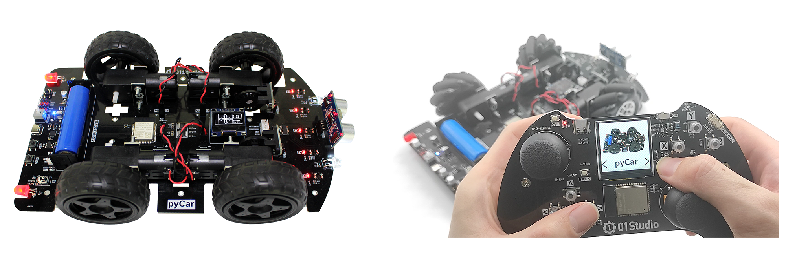

# 目录

换产品图

### **开箱指南**

- [pybalance简介](./intro/intro.md)
- [pybalance组装](./intro/assembly.md)
- [充电](./intro/charge.md)

### [**开发板资料下载**](./download.md)

### [**Python3基础知识**](./python_learn.md)

### **开发环境搭建**

- [安装开发软件Thonny IDE](./getting_start/ide.md)
- [驱动安装](./getting_start/driver.md)
- [REPL串口交互调试](./getting_start/repl.md)
- [文件系统](./getting_start/file_system.md)
- [第1个代码测试](./getting_start/demo.md)
- [代码离线运行](./getting_start/run_offline.md)
- [固件更新](./getting_start/firmware.md)

### **基础实验**

- [GPIO介绍](./basic_examples/gpio_intro.md) 
- [点亮第1个LED](./basic_examples/led.md) 
- [按键](./basic_examples/key.md) 
- [外部中断](./basic_examples/exti.md) 
- [定时器](./basic_examples/timer.md) 
- [UART（串口通讯）](./basic_examples/uart.md)
- [RGB彩灯](./basic_examples/rgb.md)
- [LCD显示屏](./basic_examples/lcd.md)
- [超声波测距（HC-SR04](./basic_examples/hcsr04.md)
- [QMI8658A六轴](./basic_examples/qmi8658.md)
- [电池电量（ADC](./basic_examples/adc.md)
- [电机控制（PWM）](./basic_examples/motor.md)

### **WiFi应用**

- [连接无线路由器](./network/connect_wifi.md) 
- [Socket通讯](./network/socket.md) 
- [MQTT通讯](./network/mqtt.md) 

### **平衡小车综合实验**

- [平衡小车基础知识](./drone/basic.md)
- [六轴传感器校准](./drone/cail.md)
- [超声波跟随](./drone/follow.md)
- [蓝牙控制](./drone/ble_control.md)
- [WiFi控制](./drone/wifi_control.md)
- [APP控制](./drone/app_control.md)
- [出厂例程](./drone/default_demo.md)

### [**更新说明**](./update.md)