# 固件更新

我们的开发板出厂已经烧录好了固件，当用户遇到故障或者需要升级固件时，可以使用本教程操作。固件更新主要有两种方式：使用烧录软件进行升级；使用在线烧录网站进行升级。用户可以根据实际使用环境选择合适的固件更新方式。

## 使用烧录软件更新固件

由于pyBalance使用USB进行下载连接，由于没有自动下载电路，因此先让开发板进入下载模式，方法如下：

按着的BOOT（KEY1）键不放，然后按一下复位（也可以断电上电），然开发板启动时候进入下载模式。

:::tip 提示
下载模式的COM号和普通编程模式的COM号不一致，可以通过我的电脑--设备管理器查看以判断是否已经进入下载模式。
:::

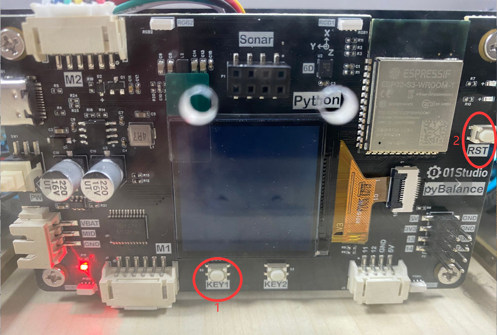

找到路径：**零一科技（01Studio）MicroPython开发套件配套资料\01-开发工具\01-Windows\固件更新工具\flash_download_tools_v3.9.2** 下的flash_download_tools_v3.9.2.exe软件，双击打开。

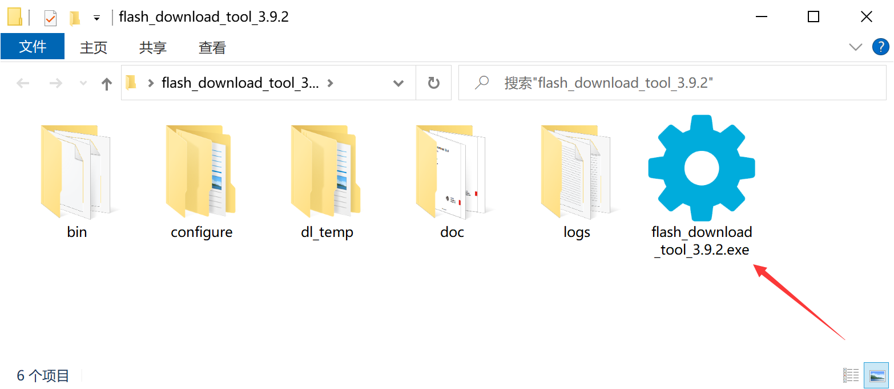

看到弹出配置窗口。芯片选择：ESP32S3；工作模式：develop；下载模式：USB。然后点击OK :

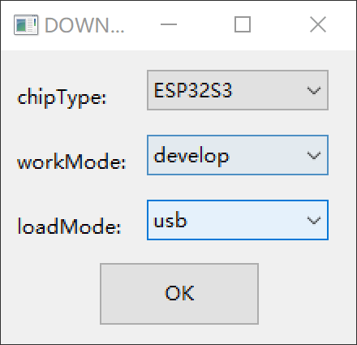

选择SPIDownload，在下图箭头位置点击，选择要烧录固件。固件位置位于：**零一科技（01Studio）MicroPython开发套件配套资料\03-相关固件目录下**。 

其它配置选项也请参考下图，注意下载地址是0x000。（COM串口是选择自己的串口，可以在设备管理器查询。）

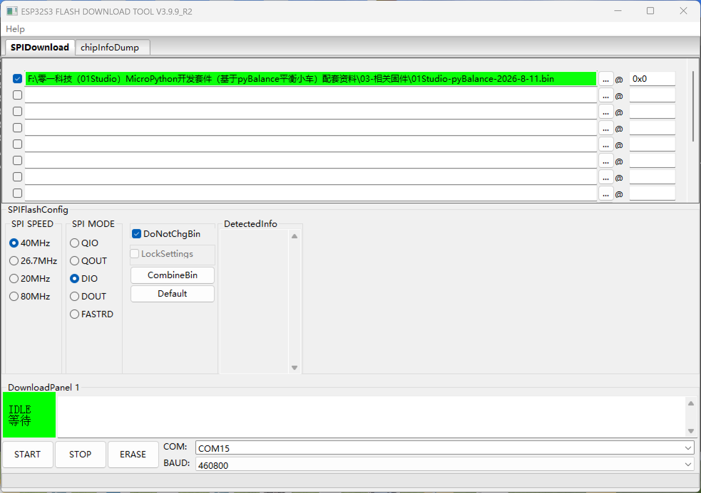

固件前面的空白框记得打√。

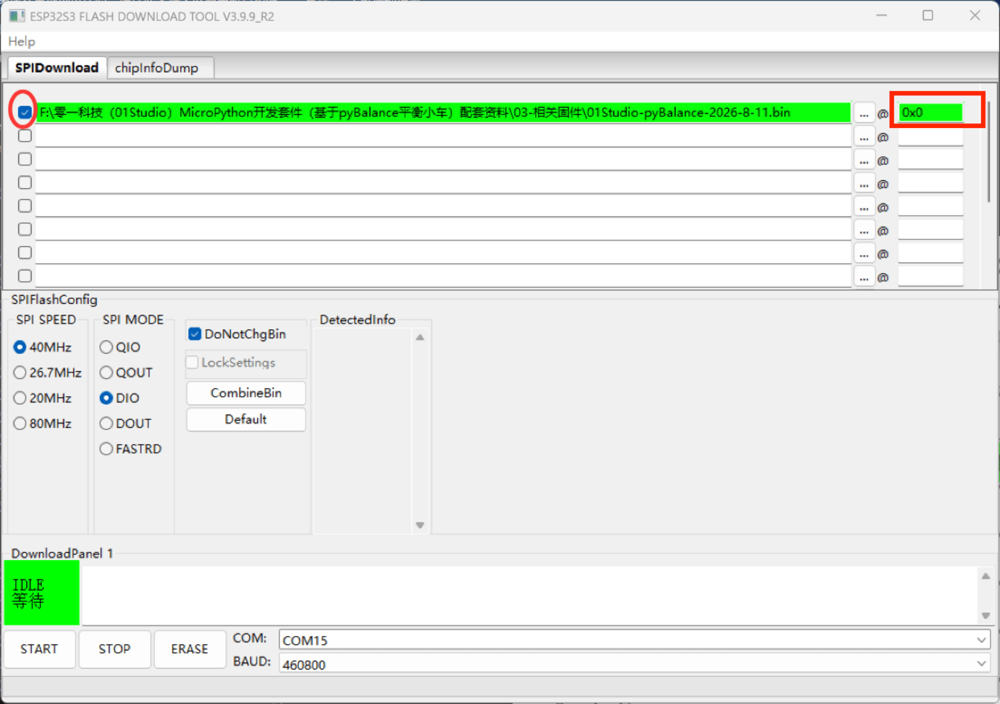

配置好后，先点击“ERASE”按钮刷除模块里面内容。点击软件下方“ERASE”按钮，刷除成功后，左边绿色框出现完成字样。

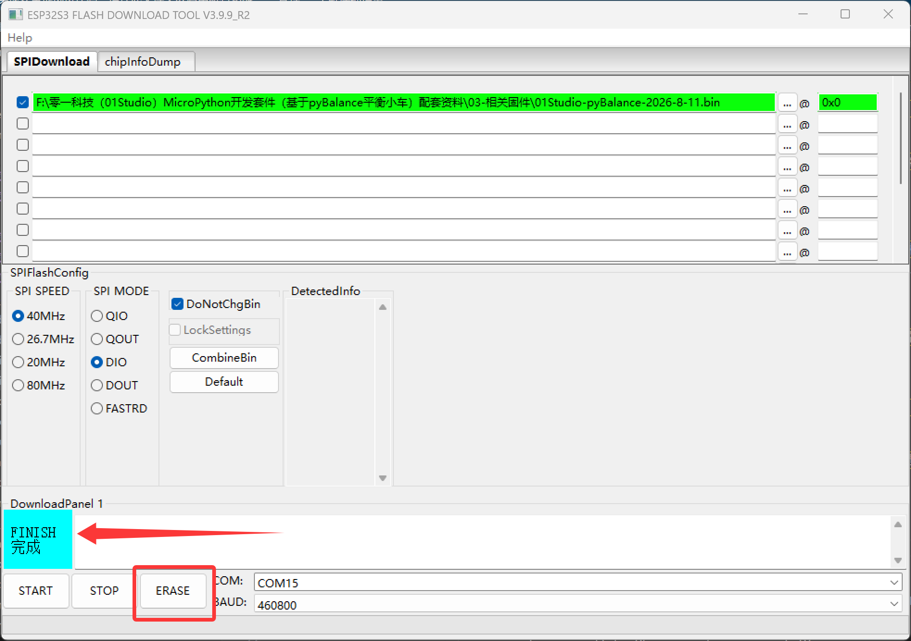

刷除成功后，点击“START”按钮开始烧录，烧录完成有左边绿色框出现“完成”字样。完成后记得点”stop”按钮或者关闭软件释放串口。

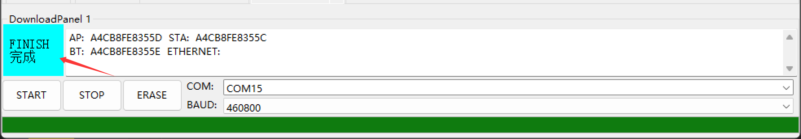

升级完成后按一下RST复位键复位一下开发板，即可使用。

## 使用在线网站更新固件

如果不想额外安装烧录软件，可以按照教程通过在线烧录方式完成固件更新。

点击“连接”后，浏览器左上方会弹出可连接的设备列表。

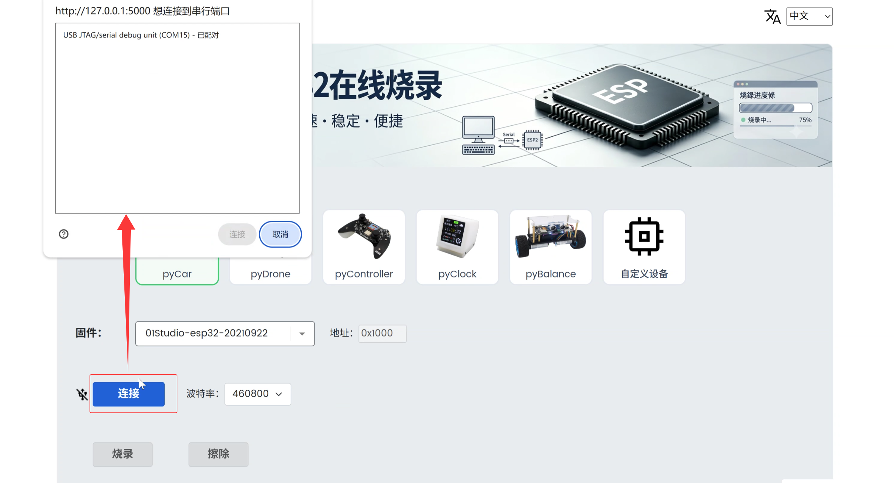

如果没有看到串行端口，需要先让 pyBalance 进入下载模式。由于 pyBalance 通过 USB 提供虚拟串口，并且没有设计自动下载电路，因此进入下载模式时需要手动操作：

按住 BOOT（KEY1） 键不放，然后按一下复位键；也可以在按住 BOOT（KEY1） 的情况下重新上电。开发板重新启动后即可进入下载模式。

:::tip 提示
下载模式的COM号和普通编程模式的COM号不一致，可以通过我的电脑--设备管理器查看以判断是否已经进入下载模式。
:::

选择对应的串行端口并点击“连接”。

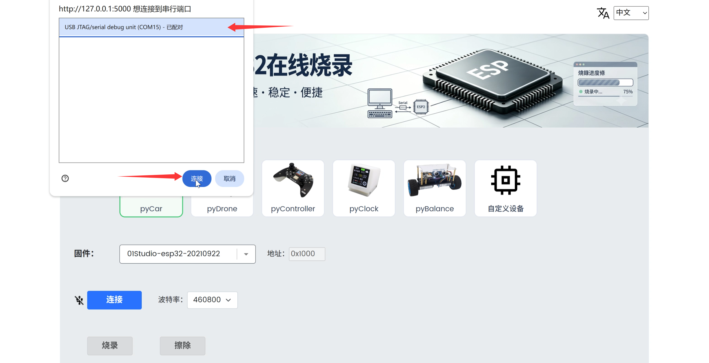

连接成功后，“连接”按钮会显示为已连接状态，左侧的连接标识也会同步更新。此时，“烧录”和“擦除”按钮由灰色不可用状态变为可操作状态，其中“烧录”按钮显示为绿色，“擦除”按钮显示为红色。同时，日志区域会显示当前连接芯片的相关信息。

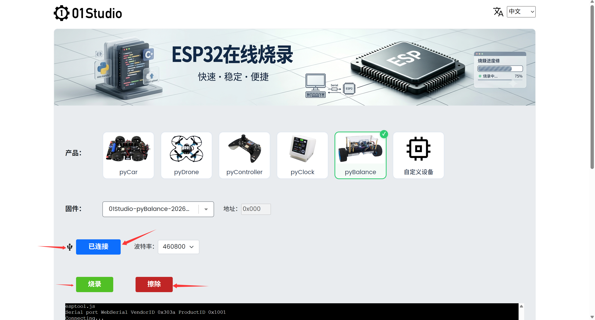

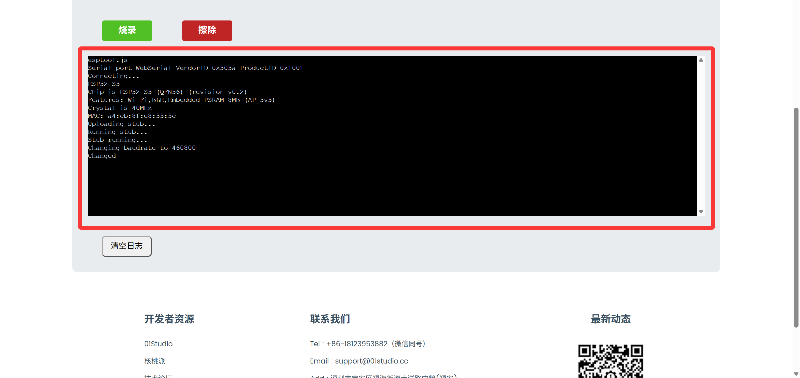

在“产品”区域中点击 pyBalance 卡片，卡片右上角出现选中标记后，表示已选择该产品。然后在下方“固件”下拉框中选择需要烧录的固件版本。固件列表中可能包含历史版本和最新版本，请根据当前开发板型号选择对应的固件。

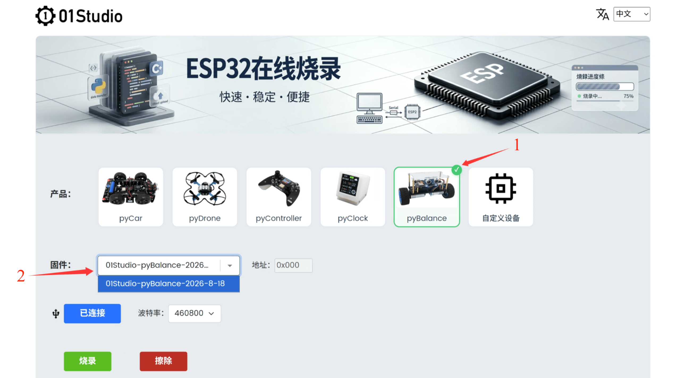

选择完成后，点击“烧录”按钮开始更新固件。

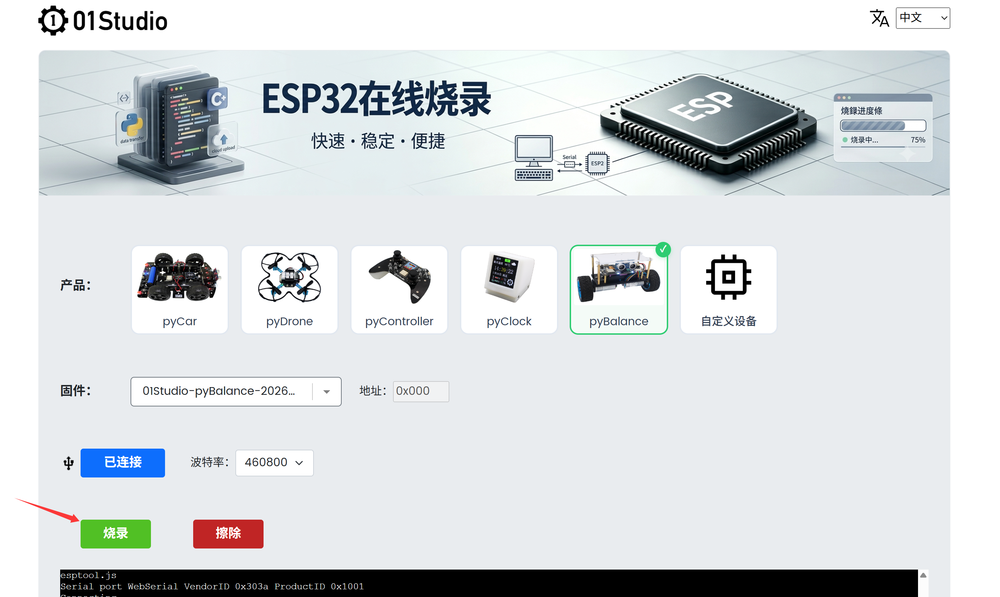

烧录完成后，日志区域会显示烧录结果，例如：Wrote 1827360 bytes (1190496 compressed) at 0x0 in 10.221 seconds.Leaving...
出现上述信息表示固件已经写入完成，此时可以重新启动开发板进入正常工作模式。

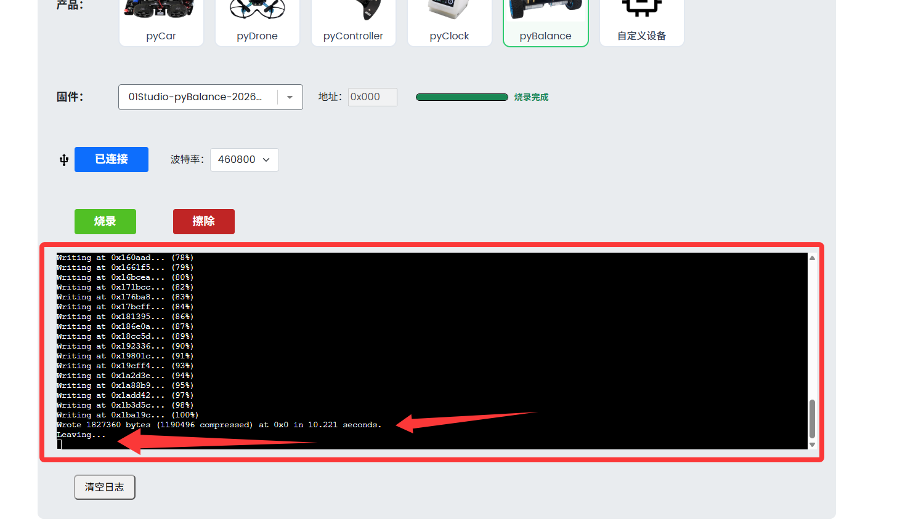

如果希望完全清除开发板中的原有数据，也可以先执行“擦除”，再重新烧录固件。执行“擦除”会清空 Flash 中的原有数据，包括文件系统中的用户文件，例如 main.py；如果只执行“烧录”，则仅更新固件，不会主动清空文件系统中的用户程序和文件。

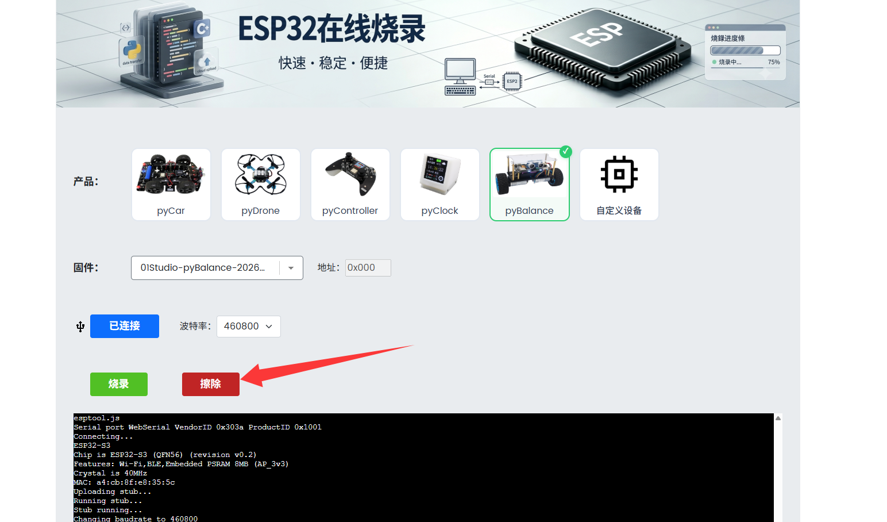

擦除成功后，日志区域会显示类似以下信息：

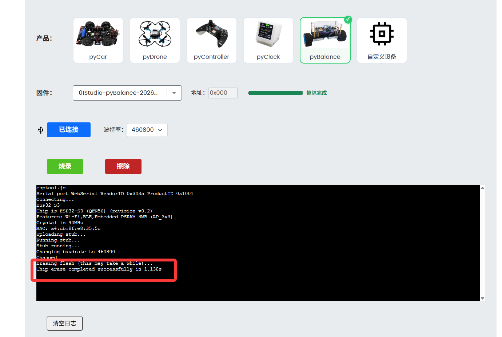

如果需要烧录自己编译生成的固件，可以使用“自定义设备”功能。连接、烧录和擦除的操作方法与前面基本一致。

在“产品”区域中点击“自定义设备”卡片，然后在“固件”区域点击“选择文件”。浏览器会打开本地文件选择窗口，从电脑中选择需要烧录的 .bin 固件文件。

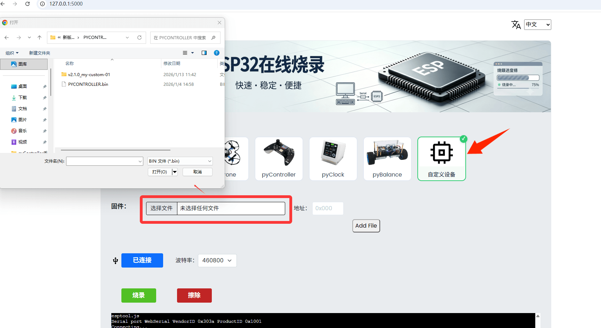

选择完成后，根据该固件对应的分区表或编译输出信息，手动填写烧录地址。

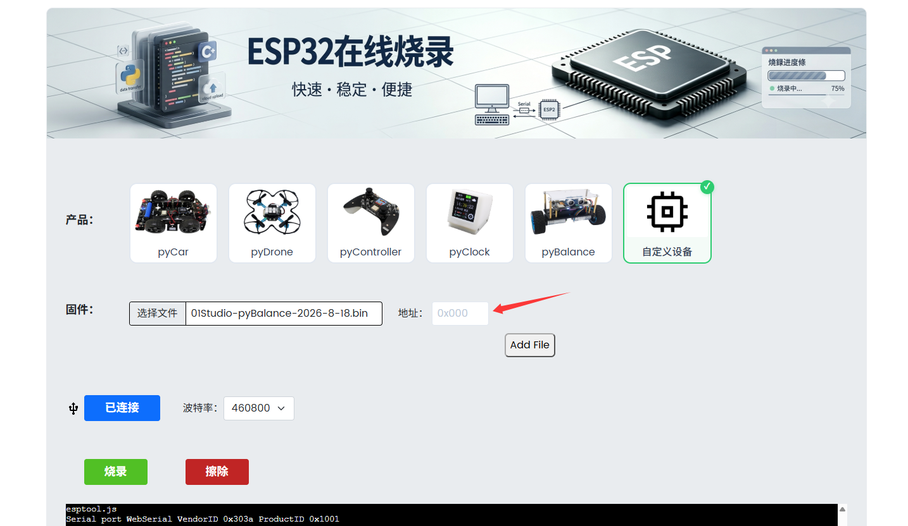

如果固件由多个 .bin 文件组成，例如需要分别烧录不同分区，可以点击 Add File 按钮新增一行，并分别选择固件文件、填写对应的烧录地址。需要继续添加文件时，可再次点击 Add File；如果添加了多余的烧录项，可以点击该行右侧的删除按钮将其移除。

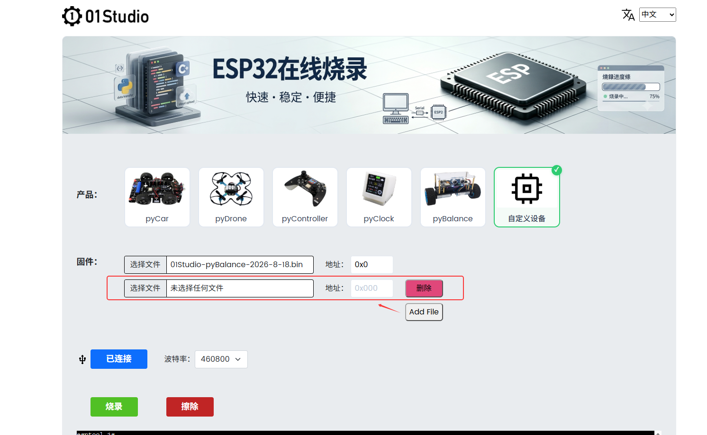

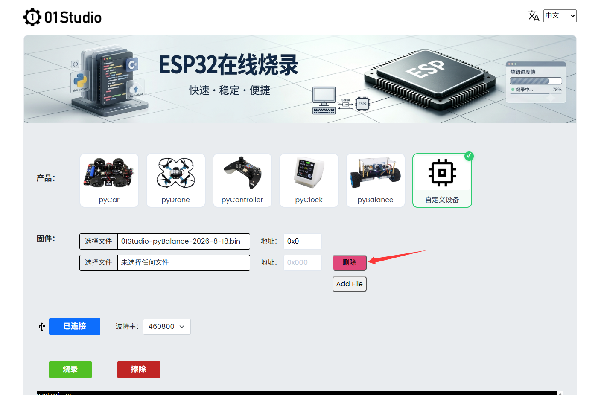

所有固件文件和烧录地址设置完成后，点击“烧录”按钮即可开始写入。