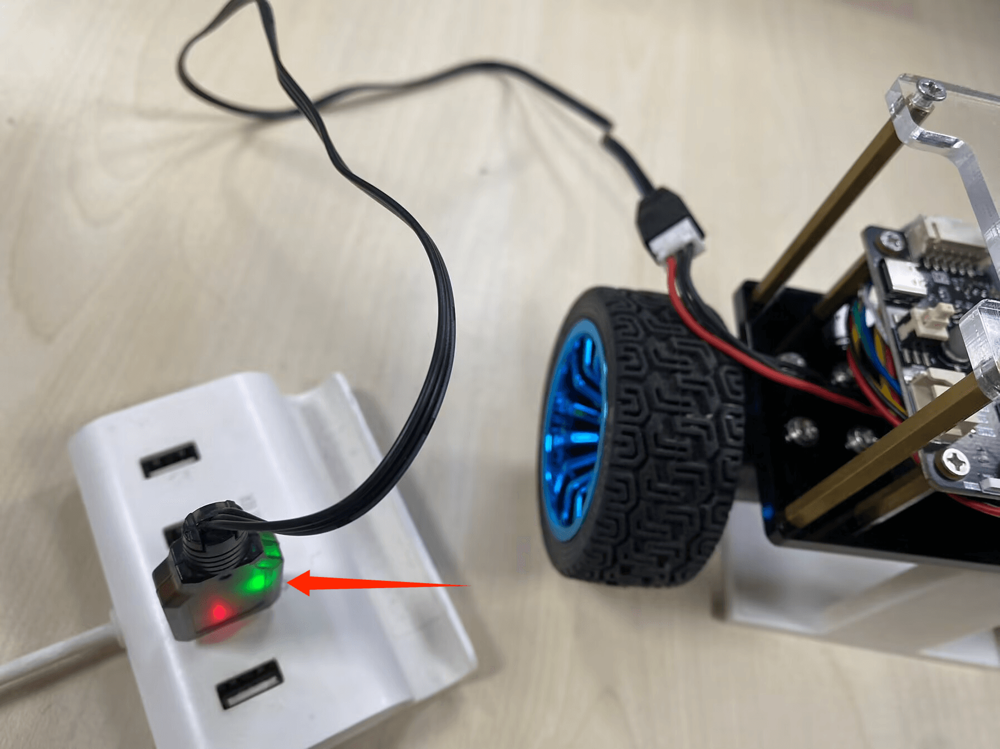
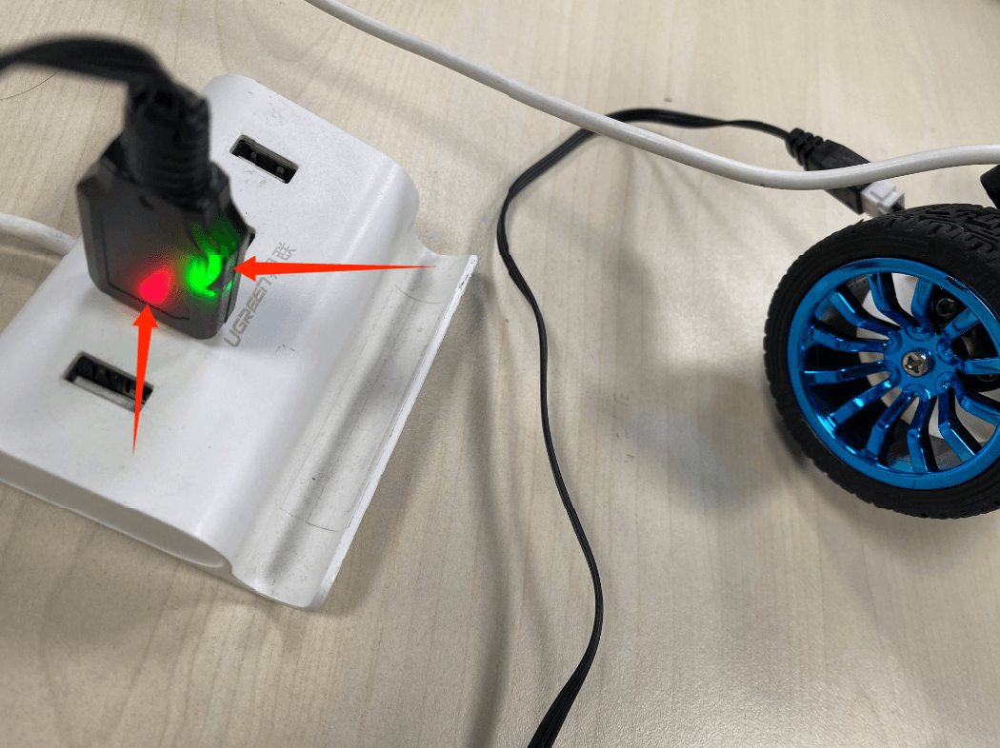

# 充电

## 使用充电线

使用配套的USB充电线即可给锂电池充电。充电的过程红灯常亮，绿灯闪。

充满后绿灯常亮，红灯还是常亮

直接通过电脑 USB 接口充电时，充电速度可能较慢。建议使用配套的充电线连接 5V/2A 电源适配器进行充电，可获得更稳定的充电电流。

:::tip 提示

电池充满后，如果重新插入 USB 充电线，充电指示灯可能会再次出现红灯常亮、绿灯闪烁的状态。此时属于重新接入电源后的充电检测过程，等待一段时间后，指示灯会恢复到充满状态。

:::