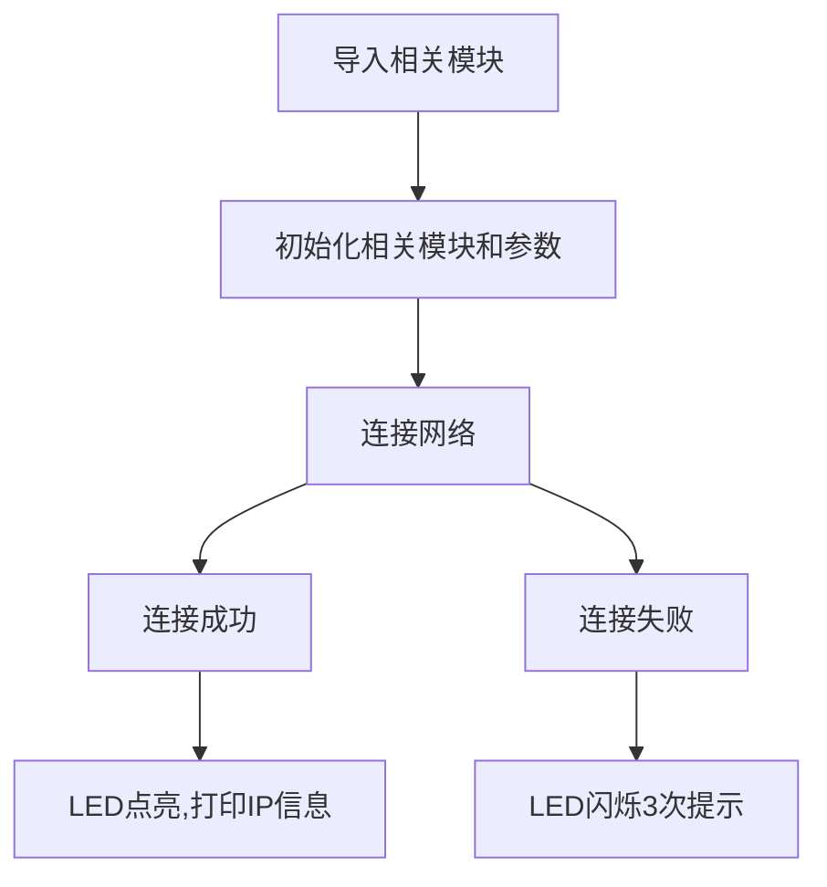

# WiFi Connect

## Foreword
WIFI plays a very important role in the Internet of Things. Now almost every household has a WIFI network. Accessing the Internet through WIFI has become a common choice for smart home products. To access the Internet, you first need to connect to a wireless router. In this section, we will learn how to use the CanMV K230 development board to connect to a router through MicroPython programming.

## Experiment Purpose

Program to connect to the router and print the IP address and other related information through the serial terminal (only supports 2.4G network).

## Experimental Explanation

Connecting to a router to surf the Internet is something we do every day. In daily life, we only need to know the router account and password to use a computer or mobile phone to connect to the wireless router and surf the Internet.

CanMV K230 has an onboard WiFi module and ceramic antenna, which can directly connect to a 2.4G wireless network.

- CanMV K230


- CanMV K230 mini


The CanMV K230 MicroPython library has integrated the network module. Developers can easily connect to the router using the built-in network module functions.

Let's first look at the constructor and usage of the network based on WiFi (WLAN module).

## class network

### Constructors
```python
wlan = network.WLAN(interface_id)
```
构建WiFi连接对象。 

- `interface_id`: 无线模式：

    - `network.STA_IF`: 客户端（STA）模式;
    - `network.AP_IF`: 热点（AP）模式。

### Methods
```python
wlan.active([is_active])
```
激活或停用网络接口。
- `[is_active]`: 激活或停用网络接口，参数为空时返回当前接口状态：

    - `True`: 激活网络接口;
    - `False`: 关闭网络接口。

<br></br>

```python
wlan.scan()
```

扫描允许访问的SSID。

<br></br>

```python
wlan.isconnected()
```
检查设备是否已经连接上。返回 `Ture`:已连接；`False`:未连接。

<br></br>

```python
wlan.connect(ssid,passwork)
```
WIFI连接。15秒超时。
- `ssid`: 账号；
- `passwork` : 密码；

<br></br>

```python
wlan.ifconfig([(ip, subnet, gateway, dns)])
```
配置WiFi信息，当参数为空时表示查看WiFi连接信息。
- `ip`: IP地址；
- `subnet` : 子网掩码；
- `gateway`: 网关地址；
- `dns` : DNS信息。

**例：wlan.ifconfig(('192.168.1.110', '255.255.255.0', '192.168.1.1', '8.8.8.8')) 。**

<br></br>

```python
wlan.disconnected()
```
断开连接。

<br></br>

更多用法请阅读官方文档：<br></br>
https://docs.micropython.org/en/latest/library/network.WLAN.html

从上表可以看到MicroPython通过模块封装，让WIFI联网变得非常简单。模块包含热点AP模块和客户端STA模式，热点AP是指其它电脑或者手机设备连接到CanMV K230发出的热点实现连接，但这样你的电脑就不能上网了，因此我们一般情况下都是使用STA模式。也就是开发板和电脑等其它设备同时连接到相同网段的路由器上。

wLAN.connect()连接15秒还没成功就退出连接。我们通过编程实现连接成功后蓝灯常亮，打印IP信息。连接失败蓝灯闪烁3次提示。

代码编写流程如下：




## 参考代码

```python
'''
实验名称：连接无线路由器
实验平台：01Studio CanMV K230
说明：编程实现连接无线路由器，将IP地址等相关信息打印出来。
教程：wiki.01studio.cc
'''

import network,time
from machine import Pin

#WIFI连接函数
def WIFI_Connect():

    WIFI_LED=Pin(52, Pin.OUT) #初始化WIFI指示灯

    wlan = network.WLAN(network.STA_IF) #STA模式
    wlan.active(True)                   #激活接口

    start_time=time.time() #记录时间做超时判断

    if not wlan.isconnected():

        print('connecting to network...')

        #输入WIFI账号密码（仅支持2.4G信号）, 连接超过5秒为超时
        wlan.connect('01Studio', '88888888')

        while not wlan.isconnected():

            #超时判断,10秒没连接成功判定为超时
            if time.time()-start_time > 10 :
                print('WIFI Connected Timeout!')
                break

    if wlan.isconnected(): #连接成功

        #LED蓝灯点亮
        WIFI_LED.value(1)

        #串口打印信息
        print('network information:', wlan.ifconfig())

    else: #连接失败

        #LED闪烁3次提示
        for i in range(3):
            WIFI_LED.value(1)
            time.sleep_ms(300)
            WIFI_LED.value(0)
            time.sleep_ms(300)

        wlan.active(False)

#执行WIFI连接函数
WIFI_Connect()
```

## 实验结果

运行程序，可以观察到连接WiFi成功后串口终端打印IP等信息。**(只支持2.4G信号只，不支持5G或者2.4G&5G混合信号。)**


本节是WIFI应用的基础，成功连接到无线路由器的实验后，后面就可以做socket和MQTT等相关网络通信的应用了。